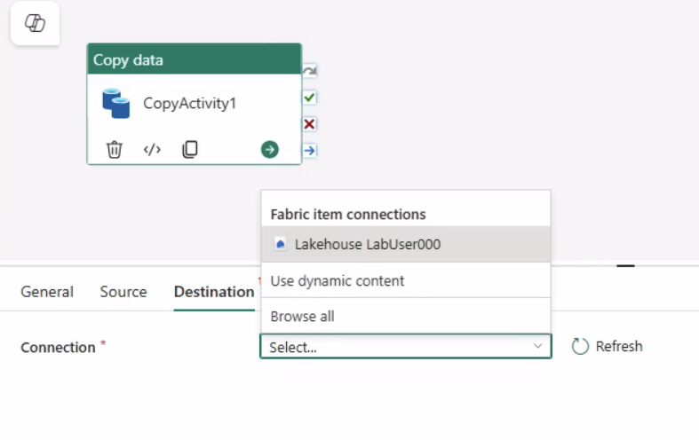
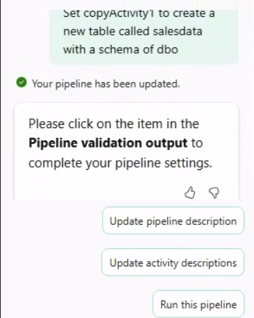
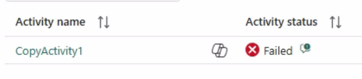
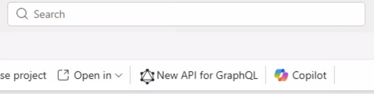
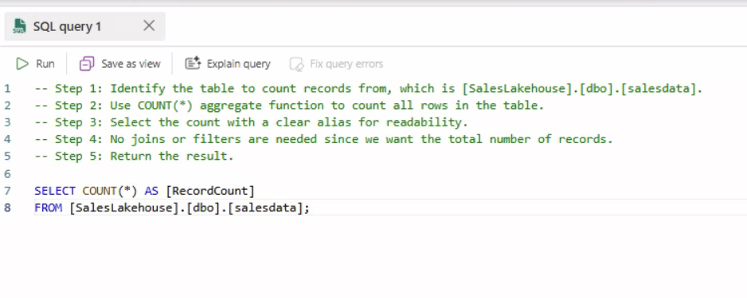
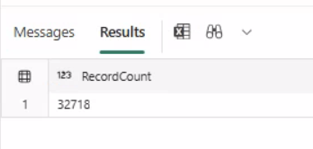
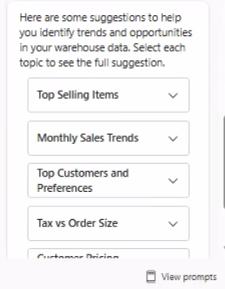
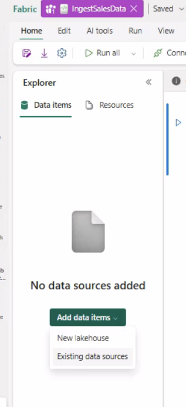
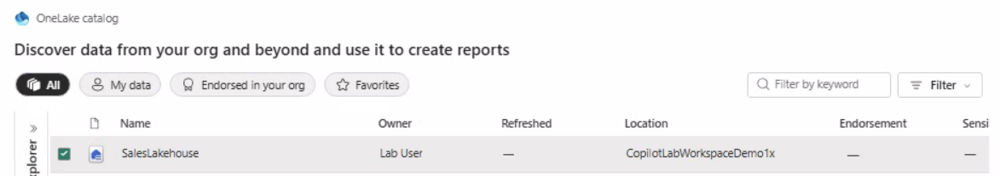
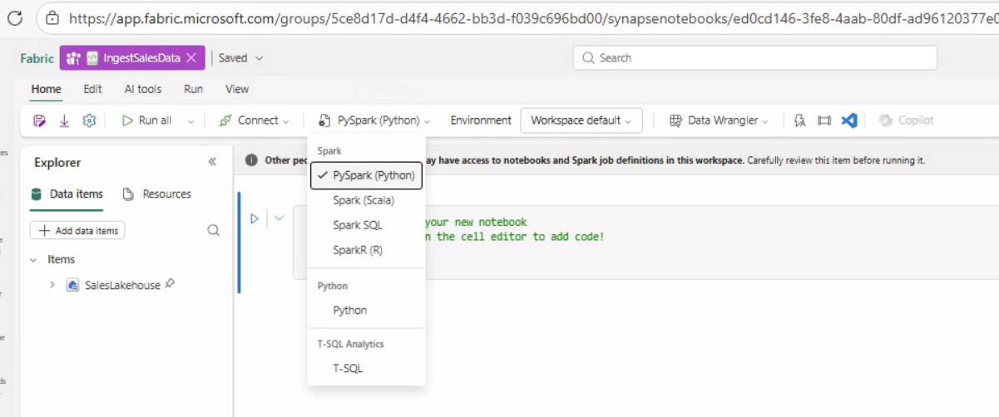

# Lab Demo 001 – Moving Data into Fabric with Copilot and Governance: Step-by-Step Guide

**Overview:** In this hands-on lab, you will **ingest data into Microsoft Fabric** and apply basic governance. You’ll start by setting up a workspace and a Lakehouse (Fabric’s unified storage layer), then load a dataset via a pipeline. Next, you’ll validate the data, perform a simple transformation using a notebook, and automate the ingestion using Fabric **Copilot** (an AI assistant in Data Factory). Finally, you’ll review pipeline monitoring and ensure security/governance settings are in place, before cleaning up. This guide provides detailed instructions **with explanations** so you can complete each task independently.

**Lab Tasks at a Glance:**

1.  **Create a Fabric Workspace** – Set up a new workspace in Fabric (on shared capacity) to contain all your lab assets.
2.  **Create a Lakehouse** – Provision a Lakehouse to serve as the governed storage layer for your data.
3.  **Ingest Data via a Pipeline** – Build a data pipeline (using the Copy Data tool) to load a CSV file from an external URL into the Lakehouse.
4.  **Validate the Ingested Data** – Verify that the file was successfully saved in the Lakehouse and preview its contents.
5.  **Transform Data with a Notebook** – Use a Fabric notebook (PySpark) to add a calculated column to the data and save the result as a curated table.
6.  **Automate Ingestion with Copilot** – Leverage Microsoft Fabric Copilot to automatically generate a parameterized pipeline that ingests the data, and then run it.
    *   *Review Pipeline Monitoring* (sub-step) – Check pipeline run history and discuss alerting options for failures (basic monitoring).
7.  **Apply Basic Security and Governance** – Ensure proper permissions on the workspace and Lakehouse, and (if available) integrate with Purview for lineage.
8.  **Cleanup** – Stop any running operations and delete lab resources if instructed, to reset the environment.

Each task below includes **why it’s important** and **how to do it** step-by-step. Follow them in order for a smooth end-to-end lab experience.

***

## Task 1: Create a Fabric Workspace

**Why?** A **Microsoft Fabric workspace** is a container for all your data assets (Lakehouses, pipelines, notebooks, etc.). Creating a dedicated workspace for this lab keeps your work organized and isolated. We will host it on **shared Fabric capacity** so it can use Fabric features like Lakehouse storage and Copilot.

**Steps:**

1.  **Navigate to the Fabric portal:** Open a web browser and go to **`https://app.fabric.microsoft.com`**. This is the entry point for Microsoft Fabric’s web interface.
2.  **Sign in:** Log in with the lab credentials provided to you (these should have at least Contributor rights in the tenant for the lab). Once signed in, you will see the Fabric home or your last used workspace.
3.  **Open Workspaces menu:** In the left-hand navigation pane, click on **Workspaces** (this is where all your workspaces are listed).
4.  **Create a new workspace:** Click **+ New workspace**. This opens a form to create a workspace.
5.  **Name the workspace:** Enter a name for your workspace, for example: `CopilotLabWorkspaceDemo1` (or use any naming convention your instructor/organization provided). Choose a name that clearly identifies it as your lab workspace.
6.  **Select Fabric capacity:** Expand the **Advanced** or **License mode** section. Ensure the workspace’s capacity is set to a **Fabric capacity** (for example, a shared capacity like `F64`). This is crucial because only workspaces on Fabric-capable capacities can use Fabric features (like Lakehouse and Data Factory pipelines). Leave this as the default if it’s already a Fabric capacity.
7.  **Permissions:** Leave the default workspace permissions as-is (unless instructed otherwise). By default, you (as the creator) will be the workspace Admin. (In a real production scenario, you’d carefully assign roles like Admin, Member, Viewer according to governance policies. For this lab, using defaults is fine.)
8.  **Create the workspace:** Click **Save** or **Create** to provision the new workspace.
9.  **Verify the workspace is ready:** The workspace should open automatically. You should see the workspace name (e.g., “CopilotLabWorkspaceDemo1”) in the top-left corner and an empty list of contents (since we haven’t added anything yet). This confirms that your new workspace is active and empty.

> **Explanation:** Creating a workspace is the first step so that all your objects (the Lakehouse, pipelines, etc.) are grouped together. Choosing a Fabric capacity means the workspace is enabled for all Fabric features (as opposed to a classic Power BI workspace). We keep default settings for simplicity, but in practice, workspace naming and permissions might follow company standards.

***

## Task 2: Create a Lakehouse

**Why?** A **Lakehouse** in Microsoft Fabric is a unified storage entity that combines capabilities of a data lake (file storage) and a data warehouse (tables). It provides a governed storage layer for your data. In this lab, the Lakehouse will be where we land the raw data file and later the transformed data table. Creating the Lakehouse now prepares a place to ingest and store data with proper organization (it will have a **Files** section and a **Tables** section).

**Steps:**

1.  **Make sure you’re in the new workspace:** At the top left of the Fabric portal, confirm that you are working inside **`CopilotLabWorkspaceDemo1`** (or the workspace you created in Task 1). All new items should be created in this workspace. If not, use the workspace selector to switch to it.
2.  **Create a new Lakehouse:** In the workspace, click **New** (or **New item** > **Lakehouse**). This starts the process to create a Lakehouse.
3.  **Name the Lakehouse:** When prompted, provide a name for the Lakehouse, e.g., `SalesLakehouse`. (If a specific name is given by your lab instructions, use that. Naming it indicates what data it will contain — here it will contain sales data.)
4.  **Create the Lakehouse:** Click **Create**. Fabric will set up a new Lakehouse item in the workspace.
5.  **Verify the Lakehouse opened:** After creation, the Lakehouse interface should open. You will see the **Lakehouse explorer** view. On the left side, find sections for **Tables** and **Files**:
    *   **Tables:** This section will list any structured tables in the Lakehouse (currently empty since we haven’t created any tables yet).
    *   **Files:** This section shows the hierarchical file storage within the Lakehouse (currently empty as well). It’s essentially a data lake folder structure.
6.  **Ensure the Lakehouse is empty:** Expand the Files section if needed; you should see nothing under it initially (no folders or files yet). This confirms the Lakehouse is brand new and ready for data.

> **What is a Lakehouse?** In Microsoft Fabric, a Lakehouse is a storage container that **unifies files and tables in one place**. You can think of it as a data lake with a built-in meta-database. Files (like CSVs, Parquet, etc.) can be stored in the **Files** area, and Spark tables or datasets can be stored under **Tables**. The Lakehouse allows data engineers to ingest raw data into a lake (files) and later refine it into structured tables – all within one resource. In this lab, we will drop a CSV file into the Files section and later convert some data to a table for analysis. Lakehouse storage is governed (you can set permissions) and is backed by the Fabric capacity you selected.

***

## Task 3: Ingest Data via a Standard Pipeline

**Why?** Now that storage is ready, we need to **bring data into the Lakehouse**. We will create a **Data Factory pipeline** to copy data from an external source into our Lakehouse. Pipelines are used for ETL (Extract, Transform, Load) or ELT processes. In this step, we’ll use a **Copy Data activity** to fetch a CSV file from a given URL and save it to our Lakehouse’s file storage. This demonstrates a typical data ingestion pattern. We’ll do it manually first (to learn the pipeline mechanics) before using Copilot to automate it later.

**Steps:**

1.  **Start creating a pipeline:** In the Fabric portal, ensure you still have the `SalesLakehouse` open (from Task 2). At the top of the Lakehouse interface, find and click **Get Data** (this may appear as an icon or a dropdown). From the menu that appears, select **New data pipeline**.
    *   *Alternate path:* If you don’t see a Get Data button in the Lakehouse, you can also create a pipeline by switching to the **Data Factory** experience. On the left sidebar, click the **Data Factory** (pipeline) icon, then choose **New** > **Pipeline**. Both methods create a new pipeline in the current workspace.
2.  **Name the pipeline:** A dialog will prompt for the pipeline name. Enter **`Ingest Sales Data`** (or a name that reflects its purpose). Then click **Create** to open the pipeline designer.
    *   The pipeline designer canvas will appear, where you can add activities (like copy data). We’ll use the built-in Copy Assistant to simplify setup.
3.  **Add a Copy Data activity using the Copy Assistant:** In the pipeline designer, find and click on **Copy Data** (often there’s a toolbar with common activities). Choose **Use copy assistant** – this is a wizard that guides you through configuring a copy activity step by step.
4.  **Choose data source (Copy Assistant Step 1):**
    *   In the Copy Data assistant, for **Source type**, search for and select **HTTP**. (We are pulling data from an HTTP endpoint.)
    *   For **Connection**, select **+ Create new connection** (since we haven’t used an HTTP connection in this workspace yet). This will open a connection setup form.
    *   **URL:** In the URL field, enter the provided dataset URL:  
        `https://raw.githubusercontent.com/MicrosoftLearning/dp-data/main/sales.csv`  
        This is a publicly accessible CSV file containing sales data. You’re pointing the pipeline to this file’s location on the internet.
    *   **Authentication kind:** Choose **Anonymous** (no auth). This URL doesn’t require any credentials (it’s a raw GitHub content link), so anonymous access is sufficient. (For secured sources, you’d choose other auth methods, but not needed here.)
    *   Click **Next** to proceed.
5.  **Specify file format (Copy Assistant Step 2):** The assistant will next ask about the source file format.
    *   Set **File format** to **DelimitedText** (since a CSV is a delimited text file).
    *   Set **Column delimiter** to **Comma (,)** (CSV stands for Comma-Separated Values).
    *   Check or ensure **First row as header** is **enabled/checked**. This means the first line of the CSV (which contains column names) will be treated as header, and not as data. This allows the pipeline to understand the column names.
    *   Click **Next**.
6.  **Choose destination (sink) (Copy Assistant Step 3):** Now we configure where to land the data in Fabric.
    *   For **Destination type**, select **Lakehouse** (because we want to land data into our Lakehouse’s file storage).
    *   For **Lakehouse destination**, choose **`SalesLakehouse`** (the Lakehouse you created in Task 2). This tells the pipeline which Lakehouse to write into.
    *   **Destination folder path:** Enter a path within the Lakehouse’s file system where the file should be placed. Use: `Files/sales/raw/`
        *   Here, `Files` refers to the root of the Lakehouse file area. We’re specifying a folder path `sales/raw/` under it. The pipeline will create these subfolders (`sales` and `raw`) if they don’t exist. This path is a way to organize data: e.g., a “sales” top-level folder, with a subfolder “raw” for raw ingested data.
    *   **File name:** Set the output file name to **`sales.csv`**. (We are keeping the same name as the source for clarity. This means the file will be saved as `sales.csv` in that raw folder.)
    *   Leave other advanced settings as default (we just need a straightforward copy).
    *   Click **Next** or **Summary**.
7.  **Review and Run (Copy Assistant Step 4):** The assistant will show a summary of the configured source and destination.
    *   Double-check that source is the correct URL and destination is the correct Lakehouse path.
    *   Then click **Save + Run** to execute the pipeline immediately. This will save the pipeline to the workspace and start the copy activity.
8.  **Monitor the pipeline run:** After running, you’ll see a **Pipeline run** panel (often at the bottom or right side) showing the progress of the pipeline.
    *   Watch the status of the **Copy Data** activity. It should go from “In progress” to **Succeeded** if everything is configured correctly.
    *   This may take a short time since the file is not huge and the source is public. Once done, a green check or “Succeeded” status will appear.
    *   If there’s an error, re-check the URL and settings. (Common mistakes might be a typo in the URL or path.)
    *   The output panel might show details like how many bytes/rows were copied, confirming success.

> **Explanation:** In this task, you built a basic pipeline to **extract** a file from an HTTP link and **load** it into your Lakehouse (this is a simple EL process—no transform in between for now). We used the Copy Data assistant for convenience. In a real scenario, the source could be a secure storage (Azure Blob, Amazon S3, database, etc.) and you’d configure appropriate connections and credentials. Here we used a public GitHub raw CSV for simplicity, which didn’t require authentication. We also designated a clear folder structure (“sales/raw”) in the Lakehouse to keep raw data organized. Having the pipeline in place means you can reuse or re-run it whenever new data arrives at the source, ensuring a repeatable ingestion process.

***

## Task 3 CP: Ingest Data via a Standard Pipeline using copilot

**Why?** This is the same ingestion you completed manually in Task 3, but authored with **Copilot** in Data Factory. It demonstrates how natural-language prompts can quickly generate a working copy pipeline, while you still validate and finalize the source/sink settings.

**Steps:**

1.  **Open the Lakehouse:** Navigate to `SalesLakehouse` in your workspace.
2.  **Start a new pipeline:** Select **Get data** > **New data pipeline**.
3.  **Name the pipeline:** Enter **`IngestSalesDataCopilot`** and create it.
4.  **Close the initial wizard (if prompted):** If the Copy Assistant/wizard opens automatically, close or cancel it so you return to the pipeline canvas.
5.  **Open Copilot:** Select **Copilot** from the pipeline ribbon. 
6.  **Generate the pipeline with a prompt:** In Copilot, enter the following prompt:
    
    `Ingest the data from https://raw.githubusercontent.com/MicrosoftLearning/dp-data/main/sales.csv into the SalesLakehouse as a table`
7.  **Confirm connections (prompted by Copilot):** Copilot will prompt you to confirm or choose the **source** and **destination** connections. 
8.  **Review the source settings:** Select the **Copy data** activity, then open the **Source** tab.
    *   Select the **URL/HTTP** connection for the source. 
    *   Ensure **File format** is set to **Avro**.
9.  **Review the destination settings:** Open the **Destination** tab.
    *   Select the **Lakehouse** connection. 
    *   Choose **`SalesLakehouse`** as the destination.
10. **Set the table name with Copilot:** In Copilot, enter the following prompt:
    
    `Set copyActivity1 to create a new table called salesdata with a schema of dbo`
11. **Save and run:** Save the pipeline, then either select **Run** or ask Copilot to run it. 

12. **Observe the failure:** Note that the pipeline run fails. Then select the Copilot icon to get troubleshooting insights. 
13. **Identify the cause:** The run fails because the **source file format** is incorrect for a CSV.
14. **Fix the source file format:** Select the **Copy data** activity, then open the **Source** tab.
    *   Confirm the **URL/HTTP** connection is selected. 
    *   Set **File format** to **DelimitedText**.
15. **Save and re-run:** Save the pipeline, then run it again (or ask Copilot to run it). 

> **Explanation:** This lab intentionally duplicates the ingestion: you completed it once manually (Task 3) and once with Copilot (this task). The key learning is the workflow: prompt Copilot to create the pipeline, then validate/update the **source**, **destination**, and **table name** before running.


## Task 4: Validate the Ingested Data

**Why?** After any data ingestion, it’s important to **verify that the data actually landed correctly**. This ensures your pipeline worked and you have the expected data before moving on. In this step, you will navigate to the Lakehouse and confirm the new file is present, then preview its contents. This validation gives confidence that the pipeline was successful and that the data schema looks right (e.g. proper headers and values).

**Steps:**

1.  **Go to the Lakehouse:** If you are still on the pipeline page with a success message, you might see a button or link that says **Open lakehouse**. Click that. (If not, manually navigate back to the `SalesLakehouse`: go to the workspace content list and open the `SalesLakehouse` item again.)
2.  **Locate the file in Lakehouse explorer:** In the Lakehouse’s left-hand explorer, expand the **Files** section. Then navigate into the folder path `sales > raw` (open the “sales” folder, then the “raw” subfolder).
    *   You should see a file named **`sales.csv`** inside **raw**. There may be an icon indicating it’s a CSV file. The presence of this file confirms the pipeline created it.
    *   Check the **timestamp** or **last modified time** of the file (the interface often shows a date/time next to it). It should correspond to the time you ran the pipeline (essentially now). This is another cue that it’s fresh from your run.
3.  **Preview the data:** Click on the `sales.csv` file. In the toolbar or right-click menu, select **Preview** (Fabric provides a preview feature for files).
    *   A preview grid will open, showing the first few rows of the CSV in a tabular format.
    *   Verify that you see column headers like `SalesOrderNumber`, `OrderDate`, `Quantity`, `UnitPrice`, etc., and that there are data rows beneath them.
    *   For example, ensure that **at least these columns are present** and populated with data:
        *   *SalesOrderNumber* (each row has an order ID)
        *   *OrderDate* (dates of orders)
        *   *Quantity* (some numeric value)
        *   *UnitPrice* (some numeric value)
    *   If the data preview looks correct (rows of data, reasonable values under each column), then the ingestion is validated.
4.  **Close the preview:** (optional) Close the preview window/pane to continue.

5.  **Switch to the SQL analytics endpoint:** Open the SQL analytics endpoint for the Lakehouse. 
6.  **Open Copilot:** Select the Copilot icon on the ribbon. 
7.  **Get started with Copilot:** Select **Get started**. 
8.  **Ask Copilot for a row count:** Use the prompt:
    
    `How many records in the table 'salesdata'`
9.  **Review the generated query:** Copilot will generate a SQL query for you. 
10. **Insert the SQL into the editor:** Select **Insert code**, and confirm it creates a new SQL query tab.  
11. **Run and validate:** Run the query and confirm the result count (expected: **32,718** rows). 
12. **Ask for additional validation queries:** Return to Copilot and ask:
    
    `What other queries should I use to validate the data and counts?`
    
    Note the suggestions Copilot provides.



> **Explanation:** By previewing `sales.csv` in the Lakehouse, you confirmed the pipeline did its job: the file is in the correct location and the content is readable. The headers indicate that the **“First row as header”** setting worked (so the first line became headers, not a data row). This step is crucial whenever you load new data, to catch any issues early (like wrong delimiter causing all data to end up in one column, or an empty file due to a bad connection). Everything looks good, so you can proceed to use this data confidently.

***

## Task 5: Transform Data with a Fabric Notebook

Now that the raw data is in the Lakehouse, let’s perform a simple **transformation** on it using a Fabric **notebook**. We will calculate a new field and store the result as a curated table. Notebooks in Fabric allow you to write code (in languages like PySpark, Spark SQL, etc.) to process your data. This approach is often used by data engineers for preparing or cleaning data before analysis.

*Estimated time:* \~15 minutes.

### 5.1 Create and Open a Notebook

**Why?** We need an environment to write and run code against the Lakehouse data. Creating a notebook attached to the Lakehouse gives us that environment. The notebook will use **Spark** under the hood, which is great for big data transformations. Attaching it to `SalesLakehouse` means it has direct access to that Lakehouse’s data (we can easily read the files and write tables there).

**Steps:**

1.  **Make sure you are in teh workspcae you created earlier:** 

2.  **Create a new Notebook:** In your workspace (still in `CopilotLabWorkspaceDemo1`), click **New** (or **New item**) and select **Notebook**.
    *   If prompted to choose an experience, pick the one that allows notebooks (Data Engineering).
3. Name the notebook "IngestSalesData" and ensure the correct workspace is slected for teh lcoation 

3.  **Attach the Lakehouse to the Notebook:** From the explorer pane, choose add data items and select SalesLakehouse. 


Make sure the lcoation is in your workspace


Choose **`SalesLakehouse`**. Then Select  **Connect** to add to the notebook.
    *   Attaching the Lakehouse means the Spark session for this notebook can directly interact with `SalesLakehouse` (read from its Files, write to its Tables).


4.  **Notebook interface:** After creation, you should see a new notebook tab open. It usually contains an empty cell and shows that it’s connected to a Spark runtime (you might see a status like “Running” or a kernel indicator).
    *   Confirm on the left side that under “Explorer”, there is an entry for `SalesLakehouse`. This indicates the notebook is properly attached.
    *   Also note the dropdown for language in the top of the cell; it might default to PySpark (Python for Spark) or No Language. We will use PySpark here.
    

> **Explanation:** In Fabric, a **notebook** is essentially a Jupyter-style notebook integrated into the service, which allows interactive coding. By attaching `SalesLakehouse`, any file path or table name we reference in Spark will be relative to that Lakehouse’s data. This integration simplifies reading/writing data – we don’t have to manually connect to storage; it’s done by Fabric. Now with the notebook ready, we can use Spark to manipulate our sales data.

### 5.2 Read the Raw Data into a DataFrame

**Why?** Before transforming data, we need to **load it into a Spark DataFrame**. A DataFrame is a distributed table in Spark that we can process with code. We’ll read the CSV we ingested in Task 3 into a DataFrame. This allows us to then perform calculations on it using PySpark.

**Steps:**

1.  **Set the notebook language to PySpark:** At the top of the first code cell, ensure the language selector is set to **PySpark** (if it isn’t already). This means the code you run in that cell will be treated as Python code executed by the Spark cluster.
2.  **Write code to read the CSV file:** Click into the first cell (replace any placeholder text if present) and type the following code:
    ```python
    df = spark.read.option("header", "true").csv("Files/Files/sales/raw/sales.csv")
    df.show(20)
    ```

    Let’s break down what this does:
    *   `spark.read.option("header", "true").csv("<path>")`: This uses Spark’s CSV reader. We specify that the CSV has a header row (`header=true`) so Spark knows to use the first line as column names. Then we provide the path to the CSV file in the Lakehouse.
    *   **Path:** The raw file is stored under the Lakehouse **Files** area.
        *   In some environments the notebook path requires an extra prefix (for example: `"Files/Files/sales/raw/sales.csv"`).
        *   In others, the single-prefix path works (for example: `"Files/sales/raw/sales.csv"`).
        *   If you have already completed Task 6 (and created the Copilot output file), you can optionally load that file instead (for example: `"Files/Files/copilot/raw/sales_copilot.csv"`).
    *   `df = ...`: This assigns the resulting DataFrame to a variable `df` for further use.
    *   `df.show(...)`: This prints a preview of the DataFrame rows to the notebook output.
3.  **Run the cell:** Execute the cell (for example, by pressing Shift+Enter or clicking the run icon).
4.  **Verify the output:** After a few moments, you should see a table output below the code cell. It will show the DataFrame’s content (similar to the preview you saw in Task 4). Check that the columns are as expected (`SalesOrderNumber`, `OrderDate`, `Quantity`, `UnitPrice`, etc.) and data rows are present. This confirms that Spark successfully read the CSV from the Lakehouse.
    *   The DataFrame `df` now holds the sales data in memory (distributed across the Spark cluster). We can use PySpark transformations on `df` next.

> **Explanation:** We used PySpark to read the CSV file stored in the Lakehouse. The string path `"Files/..."` is a relative reference to the attached Lakehouse’s file system. If the file path is correct, Spark will load that data. The `header=true` option ensured the DataFrame has column names set. Displaying the DataFrame helps confirm we have the data accessible in Spark. This step is foundational for any data transformation – loading the source data into the computation engine.

### 5.3 Add a Calculated Column and Save as a Curated Table

**Why?** A common next step after loading data is to **enhance or transform it.** In our case, we will add a new calculated column `LineTotal` (which could represent the total price for each order line by multiplying quantity by unit price). This demonstrates how to do a simple transformation using Spark. After adding the column, we’ll store the result as a **Lakehouse table** named `sales_curated`. Creating a table in the Lakehouse (instead of just leaving it as a file) makes it easier for others to query or use the data (for example, in Power BI or via SQL endpoints) and is a typical way to curate raw data into a refined dataset.

**Steps:**

1.  **Create a new code cell:** Below the output of the previous cell, click **+** (Add new cell) to insert another code cell in the notebook.
2.  **Calculate the new column:** In this new cell, type the following code to add a `LineTotal` column:
    ```python
    from pyspark.sql.functions import col

    df_curated = df.withColumn(
        "LineTotal",
        col("Quantity").cast("double") * col("UnitPrice").cast("double")
    )
    df_curated.show(20, truncate=False)
    ```

    Explanation of this code:
    *   We import `col` from `pyspark.sql.functions` to help reference columns.
    *   `df.withColumn("LineTotal", <expression>)` creates a new DataFrame (`df_curated`) that is `df` plus a new column named "LineTotal". The value of "LineTotal" for each row is defined as `Quantity * UnitPrice`.
    *   We cast `Quantity` and `UnitPrice` to double (floating-point numbers) before multiplication, to ensure the calculation handles any numeric formatting correctly (they might be strings or integers originally).
    *   Finally, we display `df_curated` to see the result.
3.  **Run the cell:** Execute this second cell. It should run quickly, and `df_curated.show(...)` will print a preview of rows including the new **LineTotal** column. The values in LineTotal should be the product of `Quantity` and `UnitPrice` for that row (for example, if Quantity was 2 and UnitPrice was 5.00, LineTotal should show 10.00).
    *   Verifying the calculation on a couple of rows is a good idea to ensure it did what we intended.
4.  **Write the curated DataFrame to a table:** Now that we have `df_curated`, we will save it as a Lakehouse table. Add another new code cell below.
    *   In the new cell, enter:
        ```python
        df_curated.write.mode("overwrite").saveAsTable("sales_curated")
        ```
        What this does:
        *   `df_curated.write` initiates a write operation.
        *   `.mode("overwrite")` means if a table or data with the same name already exists, overwrite it (replace it). We use this to ensure the command can run even if we retry it; it will just update the table.
        *   `.saveAsTable("sales_curated")` tells Spark to save the DataFrame as a **named table** in the Lakehouse, called `"sales_curated"`. Under the hood, this creates a Delta table in the Lakehouse’s table storage.
5.  **Run the save cell:** Execute the cell with the save command. It may take a few seconds as Spark writes out the data. If it finishes without error, the table is now saved.
6.  **Verify the table in the Lakehouse:** Go back to the Fabric UI (the Lakehouse explorer). You might need to refresh the Lakehouse view. Now, look under the **Tables** section (left side of the Lakehouse explorer).
    *   You should see a new table listed called **sales\_curated**. This appeared because `saveAsTable` registered a new table in the Lakehouse.
    *   Click on **sales\_curated** in the Tables list, and select **Preview** (just like previewing a file). You should see the table data, including the original columns and the new **LineTotal** column for each row.
    *   The data in `sales_curated` should have the same number of rows as the original CSV, just with one extra column.
7.  **Close or stop the notebook (optional):** You can stop the Spark session attached to your notebook to free resources if you are done using it (in the notebook toolbar, there might be a “Stop session” or “Detach”). This is a good practice in shared environments to avoid consuming capacity when not needed.

> **Explanation:** In this task, you performed a transformation using PySpark:
>
> *   We calculated a new field (`LineTotal`) to enrich the data. This is a simple example of a transformation — in real projects, you might do more complex operations like joins, aggregations, or data cleansing in a notebook.
> *   We then saved the result as a **Lakehouse table** (`sales_curated`). In Fabric, saving as a table has advantages: the table is stored in a format (like Delta) that can be queried via the Lakehouse’s SQL endpoint or used by other Fabric items (like Power BI datasets). It’s also easily discoverable in the Lakehouse UI under Tables.
> *   This demonstrates an EL**T** approach: we first **Extracted** and **Loaded** raw data (Tasks 3 and 4), and now we **Transformed** it in-place. Often, data engineers will automate running such notebooks as part of pipelines, possibly with a service account for consistent access control. In a production scenario, you might not run the notebook manually but schedule it so that data is processed regularly.
> *   *Governance note:* In production, it’s recommended to run notebooks or pipelines using service principals or Managed Identities, rather than personal accounts, so that all actions are tracked under controlled credentials. This ensures auditability and adherence to security policies.


### 5.4 (Optional) Use Copilot to Generate More Advanced Calculations

**Why?** Copilot can help you quickly draft more complex PySpark transformations (date parsing, derived columns, and aggregations). The key skill is to **prompt clearly** and then **review the generated code** before you run it.

**Steps:**

1.  **Open Copilot in the notebook:** In the notebook toolbar, select **Copilot** to open the Copilot chat pane.
2.  **Enter a prompt for advanced calculations:** Paste the prompt below (it assumes you already ran Task 5.2 and still have `df` in memory):

    `Using the df DataFrame already loaded from the sales CSV, generate PySpark code that: (1) creates an enriched DataFrame with a robust OrderDateParsed date column from OrderDate (try multiple common date formats), (2) adds LineTotal = Quantity * UnitPrice (cast both to double), (3) derives OrderYear and OrderMonth, and (4) creates a monthly summary DataFrame with OrderCount, TotalSales, and AvgLineTotal, then shows the top 12 months by TotalSales.`
3.  **Review what Copilot generates:** Copilot may choose different variable names, but the logic should look similar to the “expected cell” below.
4.  **Run the generated cell:** Execute the code and confirm you get a monthly summary output.

**Expected generated cell (example):**

```python
from pyspark.sql.functions import (
    col,
    to_date,
    coalesce,
    year,
    month,
    sum as _sum,
    avg,
    count,
)

df_enriched = (
    df
    .withColumn(
        "OrderDateParsed",
        coalesce(
            to_date(col("OrderDate"), "M/d/yyyy"),
            to_date(col("OrderDate"), "MM/dd/yyyy"),
            to_date(col("OrderDate"), "yyyy-MM-dd"),
            to_date(col("OrderDate"))
        )
    )
    .withColumn(
        "LineTotal",
        col("Quantity").cast("double") * col("UnitPrice").cast("double")
    )
    .withColumn("OrderYear", year(col("OrderDateParsed")))
    .withColumn("OrderMonth", month(col("OrderDateParsed")))
)

df_monthly = (
    df_enriched
    .groupBy("OrderYear", "OrderMonth")
    .agg(
        count("SalesOrderNumber").alias("OrderCount"),
        _sum("LineTotal").alias("TotalSales"),
        avg("LineTotal").alias("AvgLineTotal")
    )
)

df_monthly.orderBy(col("TotalSales").desc()).show(12, truncate=False)
```

> **Explanation:** This exercise shows a more realistic “analytics” transformation: you enrich raw rows with derived columns and then aggregate to a summary view (monthly totals). Copilot can accelerate this, but you still validate column names, date parsing, and output before using it in a pipeline or production process.


***

## Task 6: Automate Ingestion with Fabric Copilot

Now that you’ve done one ingestion pipeline manually, let’s see how **Copilot** can help. **Copilot in Microsoft Fabric (for Data Factory)** is an AI-powered assistant that can generate data pipelines from natural language prompts. We will use Copilot to create **another pipeline that does the same ingestion** of the sales data, but in a parameterized way. This shows how AI can speed up development. You’ll then run this generated pipeline and confirm it works.

### 6.1 Open a New Pipeline and Launch Copilot

**Why?** We need a fresh pipeline canvas to use Copilot. Copilot will insert activities into whatever pipeline is open. By creating a separate pipeline, we keep it distinct from the one you built manually. This also allows us to differentiate the output (we will have it write to a different folder so we don’t overwrite the first file).

**Steps:**

1.  **Create a new pipeline:** In your Fabric workspace (`CopilotLabWorkspaceDemo1`), click **New** > **Data pipeline** (similar to how you created the first one, but this time do it from the workspace +New menu or via the Data Factory section).
2.  **Name the pipeline:** Enter **`Copilot Ingest Sales`** as the pipeline name. Click **Create** to open it.
3.  **Open Copilot pane:** Once the pipeline designer opens (it will be an empty pipeline), find and click the **Copilot** icon – it often looks like a sparkles or stars icon on the right side of the pipeline editor. Clicking it will open the Copilot chat panel.
4.  **Wait for Copilot to be ready:** The Copilot panel will likely show a welcome message or a status indicator (like “Loading” or “Initializing”). Wait until it says **Ready** or gives you a prompt box to enter instructions. This indicates the AI assistant is ready to accept your request.

> **Explanation:** At this point, you have an empty pipeline (“Copilot Ingest Sales”) and the Copilot assistant open. Copilot is context-aware to some extent – it knows about the workspace and can create connections/datasets within this pipeline. We will feed it a description of what we want, and it will propose pipeline components. This tool can dramatically speed up pipeline creation, but it’s essential to review what it produces.

### 6.2 Use Copilot to Generate the Pipeline

**Why?** Instead of manually adding a Copy Data activity and configuring it (as we did in Task 3), we’ll let Copilot do that through a prompt. We’ll instruct Copilot to create a pipeline that copies the same sales CSV into our Lakehouse, but ask it to **parameterize** the file name. Parameterization is useful for reusability (e.g., you could use the same pipeline for different file names or similar datasets by changing a parameter, without editing the pipeline logic).

**Steps:**

> **Note:** Copilot is **probabilistic**, not deterministic. If your generated pipeline looks different from the screenshots or steps, adjust as needed and focus on the intended outcome (correct source URL, correct Lakehouse destination path, and the expected output file).

1.  **Enter the prompt for Copilot:** In the Copilot chat box, paste or type a clear request. For example:  
    `"Create a pipeline that copies sales data from https://raw.githubusercontent.com/MicrosoftLearning/dp-data/main/sales.csv into my SalesLakehouse. Store the file under Files/copilot/raw/sales.csv and parameterize the file name."`
    *   This prompt tells Copilot exactly what we want:
        *   The source URL (the same one you used earlier).
        *   The destination (SalesLakehouse, under a folder path `Files/copilot/raw/`).
        *   The file name to use (`sales.csv`), but also that this file name should be a parameter (meaning Copilot should make it a variable).
2.  **Send the prompt:** Click **Generate** (or press Enter) to send the request to Copilot.
3.  **Choose/confirm connections:** If Copilot prompts you to select connections, click into the placeholder field and type `/` to list available connections. Select the **HTTP** connection for the source and the **Lakehouse** connection for the sink (prefer the ones you created earlier).
    *   If Copilot asks to create new connections/datasets, approve the prompts. For the HTTP source, keep authentication as **Anonymous**.
4.  **Wait for pipeline generation:** After a few moments, Copilot will add components onto the pipeline canvas automatically. You should see at least:
    *   A **Copy data** activity (likely with a default name like “Copy data 1”).
    *   Some datasets or connection references on the left panel (possibly a new HTTP dataset for the source and a Lakehouse dataset for the sink).
    *   It might also create a pipeline parameter (for the file name) visible in the pipeline’s settings.
    *   Copilot might also show a textual response describing what it did.

> **Explanation:** In this step, Copilot interpreted your instructions and built the pipeline. This usually includes setting up an HTTP **source dataset** with the given URL, a **sink** pointing to the Lakehouse and folder, and wiring them into a **Copy Data activity**. The noteworthy part is making the file name a parameter – this means the pipeline isn’t hardcoded to “sales.csv” but uses a variable (so we can easily change it when running the pipeline). Copilot’s value is speed and convenience; however, it might not get everything perfect, so we will review its work next.

### 6.3 Review and Tweak the Copilot-Generated Pipeline

**Why?** It’s important to **verify what Copilot created**. As the human in the loop, you need to ensure the settings align with your intentions and adjust anything necessary. This is a best practice whenever using AI-generated code: treat it as a first draft that you might need to edit. We’ll check that the source and sink settings are correct, and then adjust the default parameter value for clarity.

**Steps:**

1.  **Check the Copy activity:** On the pipeline canvas, click on the **Copy data** activity that Copilot added.
    *   Look at its properties (usually a panel below or on the right shows Source and Sink settings when the activity is selected).
2.  **Verify Source settings:** There should be a source dataset (likely named something like “<your pipeline name>\_HTTP\_source” or similar). Check that:
    *   **Base URL** is exactly `https://raw.githubusercontent.com/MicrosoftLearning/dp-data/main/sales.csv` (the URL of the sales CSV).
    *   **First row as header** is enabled (Copilot typically infers this because of the prompt content, but ensure it’s true so the CSV’s header is recognized).
    *   The file format should be Delimited Text with comma delimiter (again, Copilot usually sets this based on the data).
3.  **Verify Sink settings:** Check the sink (destination) configured on the Copy activity.
    *   It should be targeting **SalesLakehouse** (you might see a Lakehouse icon and the name or a reference to it).
    *   The **Folder path** should be `Files/copilot/raw/` as requested.
    *   The **File name** might show something like `@pipeline().parameters.FileName` instead of a literal “sales.csv”. This indicates it’s using a pipeline parameter for the name.
    *   The default value for that parameter at creation might be “sales.csv” if Copilot set it up that way.
4.  **Locate the pipeline parameter:** In the pipeline editor, find the **Pipeline settings** or **Parameters** section. (Often there’s a panel or a button for pipeline parameters – possibly an icon of double curly braces { } or in the properties of the pipeline itself.)
    *   You should see a parameter named **FileName** (created by Copilot because we said “parameterize the file name”).
    *   Check its default value. Copilot likely set the default to “sales.csv” as per the prompt.
5.  **Change the default FileName (for clarity):** Click the FileName parameter to edit it. Change its default value from `sales.csv` to **`sales_copilot.csv`**.
    *   Why? This way, when we run this pipeline, it will output a file named `sales_copilot.csv`. We already have `sales.csv` from our manual pipeline; using a different name prevents confusion or overwriting. It also helps us distinguish the two results.
    *   By changing only the default, we ensure the pipeline still uses the parameter. (We could also just type in the sink “sales\_copilot.csv” directly, but updating the parameter default is more in line with the intended usage.)
6.  **Save the pipeline:** Click **Save** on the pipeline toolbar. This ensures the changes (like the parameter default) are persisted. The pipeline “Copilot Ingest Sales” now is ready to run with our adjustments.

> **Explanation:** Reviewing the pipeline is critical. We confirmed Copilot set the correct source URL and configured the Lakehouse sink properly. We also updated the parameter so that it doesn’t write out with the same name as our first pipeline’s file. This demonstrates a key point: **Copilot is a helper, but you remain the owner of the pipeline.** You should validate connections (maybe Copilot created a new HTTP connection behind the scenes, which is fine here), schemas, and any variable settings. In this case, the edits were minor. In other cases, you might find you need to correct a dataset path or add a missing setting. Always double-check before running an AI-generated pipeline in production.

### 6.4 Run the Copilot-Generated Pipeline

**Why?** Now that we have the Copilot-created pipeline configured, we need to run it to actually perform the data copy. This will fetch the data (again from the same source) and land it in the Lakehouse under the new location. Running it also lets us gather a pipeline run record (which we’ll look at in the next sub-step for monitoring). We’ll accept the default parameter (which we set to `sales_copilot.csv`).

**Steps:**

1.  **Initiate a pipeline run:** In the pipeline editor, click the **Run** button (usually at the top menu of the pipeline designer).
2.  **Enter run parameters:** When you click Run, if the pipeline has parameters (which it does, FileName), a dialog will appear asking for those parameter values.
    *   You should see **FileName** listed with a text box. It should already show the default value `sales_copilot.csv`.
    *   Leave it as is (since that’s what we want to use).
    *   Click **Run** (in the dialog) to start the pipeline.
3.  **Monitor the run:** Just like with the manual pipeline, an **Output** or run pane will show up displaying the status. Watch the Copy activity execute.
    *   It should hopefully succeed quickly (since it’s the same data source of a modest CSV file).
    *   If it shows **Succeeded**, then Copilot’s pipeline worked as intended. If there’s an error, read the message; but if everything was configured as reviewed, it should be fine.
4.  **(Optional) View run history:** After it runs, you might click on **Pipeline runs** (either from the success banner or an icon in the pipeline editor) which can show a history of runs. You should see this run (with a timestamp, status Succeeded, and the parameter value used). This is just to note that Fabric logs pipeline runs which is useful for auditing and debugging.

> **Explanation:** Running the pipeline confirms that the Copilot-generated pipeline can successfully perform the task. We used the parameter default, so it copied the data to `sales_copilot.csv` in the Lakehouse. This step was essentially repeating the ingestion, but with a pipeline that was mostly authored by AI. It reinforces that the pipeline configuration was correct. In a real scenario, you might use such a pipeline to regularly fetch new data or to handle multiple files by providing different parameter values on each run (for example, different file names or paths). Next, we’ll verify the output just like we did for the first pipeline, and then discuss monitoring and alerts.

### 6.5 Validate Copilot Pipeline Output in the Lakehouse

**Why?** Just as we verified the manual pipeline’s results, we must verify that the Copilot pipeline created the intended output. We expect a file `sales_copilot.csv` in the Lakehouse under `Files/copilot/raw/`. Checking this ensures our end-to-end Copilot scenario is successful and we have both raw files in our storage.

**Steps:**

1.  **Open the Lakehouse (if not already open):** If you’re still on the pipeline page, click **Go to lakehouse** in the success notification. Or navigate back to `SalesLakehouse` via the workspace content list.
2.  **Find the Copilot output file:** In the Lakehouse explorer’s **Files** section, expand **copilot** then **raw** (this folder path was created by the pipeline if it didn’t exist).
    *   You should see the file **`sales_copilot.csv`** listed there.
    *   Check that its timestamp corresponds to the run you just did (should be the most recent, likely a few minutes or seconds after the first file’s timestamp).
3.  **Preview the file:** Click on `sales_copilot.csv` and choose **Preview**.
    *   Confirm that the data looks the same as before (it’s the same source data). You should see the columns `SalesOrderNumber, OrderDate, Quantity, UnitPrice` and rows of data.
    *   Essentially, `sales.csv` and `sales_copilot.csv` should contain identical datasets (just stored in two locations).
4.  **Close the preview:** (after verifying).

> **Explanation:** We have now ingested the **same data via two pipelines**: one created manually and one via Copilot. Both results are present in the Lakehouse. In practice, you might not duplicate data like this, but this was for learning purposes. The Copilot pipeline output was validated to ensure that even when using AI assistance, you get the correct outcome. Always validate after using Copilot to make sure nothing was missed by the AI. Also, note that Copilot created a parameterized solution which could be handy if we wanted to run this pipeline for, say, `sales_September.csv` vs `sales_October.csv` by just changing the parameter.

***

### 6.6 (Bonus) Review Pipeline Monitoring and Alerts

*This sub-task is a brief exploration of monitoring capabilities. If you’re short on time, consider it optional but it provides insight into operating pipelines in a production environment.*

**Why?** After setting up pipelines, a data engineer should know how to **monitor their execution and set up alerts**. In a shared or production environment, you need to track successes, failures, performance, and possibly get notified of issues. Fabric provides run histories and can integrate with alerting mechanisms. We’ll take a quick look at the monitoring view and discuss how one might handle alerts.

**Steps:**

1.  **Open the Pipeline runs view:** In the pipeline editor for **Copilot Ingest Sales**, click on **Pipeline runs** (this might be an icon of a clock or list in the top-right of the pipeline canvas). If you closed the editor, you can find the pipeline in the workspace, click the “...” menu on it and choose “Pipeline runs”.
2.  **Examine recent runs:** You should see a list of pipeline run instances (for this pipeline). For each run, note:
    *   **Status:** e.g., Succeeded (green) or Failed (red) or In progress.
    *   **Start time** and **End time** (or duration). This tells you how long the pipeline took and when it ran.
    *   You might see both the manual run you triggered and perhaps any others if you ran it multiple times.
3.  **View run details:** Click on a specific run (for example, the one that succeeded). This will show a detailed view:
    *   Each activity (here just the Copy Data) with its duration and any logs.
    *   If an activity failed, this is where you’d see error messages or failure details to troubleshoot.
4.  **Check for alert settings:** In Fabric (or Azure Data Factory generally), you can often configure alerts. In a lab environment, you might not actually set up email alerts, but be aware:
    *   You could set an alert to email or notify if a pipeline fails.
    *   You might configure triggers to auto-run pipelines on schedules or when new data arrives, and have monitoring around that.
    *   In the workspace or Fabric admin settings, there may be a section for notifications or rules (though this may require admin permissions).
5.  **Discuss monitoring strategy (thought exercise):** Think about a scenario with many pipelines:
    *   How would you monitor pipeline health? (Perhaps via a dashboard that tracks all runs, or using Fabric’s integration with Azure Monitor/Log Analytics.)
    *   If a pipeline repeatedly fails due to, say, an unavailable source or a schema change, how would you escalate? (One might set up an alert to the data engineering team, who would then investigate the errors.)
    *   Consider automatic remediation: For example, if a pipeline fails due to a transient issue, you might auto-retry it or have a failover mechanism.
    *   In Fabric, beyond the basic runs view, there are also **diagnostic logs** and '**lineage**' views that can help trace data flows end to end. In large environments, these help identify where a failure or bottleneck occurred.

> **Explanation:** Monitoring and alerting are part of **governance and operations**. While the lab doesn’t require setting up an alert, it’s good to know that Fabric pipelines can be monitored systematically. The **Pipeline runs** interface is your first stop for checking if your pipelines ran successfully and how long they took. For ongoing operations, one could integrate Fabric with Azure Monitor to send logs to a Log Analytics workspace, enabling advanced alert rules and dashboards. Since this is a shared lab environment, also be mindful that many users running intensive pipelines can consume capacity – monitoring can help ensure one pipeline isn’t over-consuming resources or failing silently. Always plan for how to handle pipeline failures (notifications, retries, etc.) as part of production readiness.

***

## Task 7: Apply Basic Security and Governance Patterns

Finally, it’s critical to consider **security and governance** for your data. In this task, you will ensure that access permissions are set correctly on the workspace and Lakehouse, and understand how this ties into broader governance (like Microsoft Purview for data catalog and lineage). This step connects what you did to organizational best practices: ensuring only the right people can access the data and that data movement is transparent.

**Why?** Data governance involves managing **who has access** to data and **how data is tracked and audited**. We want to verify that our lab workspace isn’t inadvertently open to others, and that our Lakehouse data is only accessible to us (the lab user) or intended roles. If Purview (Microsoft’s data catalog and governance tool) is available, integrating it can automatically capture the lineage from source to destination, which is valuable for compliance and traceability.

**Steps:**

1.  **Open workspace access:** In the Fabric portal, open your workspace **CopilotLabWorkspaceDemo1**.
    *   In the workspace header/command bar, select **Manage access** (sometimes shown as a people icon).
    *   If you don’t see **Manage access**, open the workspace menu (**…**) and look for **Manage access** or **Workspace access**. (In some UI layouts it’s under **Workspace settings**.)
    *   This view shows who has what role in the workspace.
2.  **Review workspace roles:** Ensure that only the expected accounts are listed. For a lab subscription, you might see:
    *   Your account as an **Admin**, **Member**, or **Contributor**.
    *   Perhaps a lab supervisor or service account as Admin.
    *   There should not be any strangers or external accounts.
    *   Roles:
        *   **Admin** can manage all aspects (usually you or facilitator).
        *   **Member** can create and manage most content.
        *   **Contributor** can create and edit content.
        *   **Viewer** would have read-only access (maybe not used in this lab unless specified).
    *   Confirm that you have at least contributor rights, which you do if you could create all these items.
3.  **Check Lakehouse item access:** In the workspace, find the `SalesLakehouse` item. Select **...** > **Manage access** (or **Manage permissions**).
    *   Many environments inherit access from the workspace. If you don’t see separate item-level access controls, that’s expected.
    *   You should still see your user with at least **Contributor** access via the workspace role.
    *   Ensure no unexpected users or groups have access. (In a multi-tenant environment, it’s possible to share items, but in this lab, likely only you/the workspace roles have access.)
    *   If there are roles like **Viewer** for others, ensure that’s intended (maybe for a scenario where someone else should only read the data).
4.  **Consider Lakehouse-level security:** If your environment supports fine-grained security (some previews allow item-level or folder-level permissions within Fabric):
    *   Ensure that only appropriate groups/users can access sensitive portions (for example, if you had a folder “sales/raw”, you could potentially restrict who can see raw vs curated data).
    *   For this lab, we won’t change anything, but be aware that Lakehouse items should be governed: e.g., you might give a data science team access to read curated data but not write, etc.
    *   Document which groups can write vs. read, if this were a real project, for clarity.
5.  **Verify pipeline permissions (if applicable):** Generally, pipeline permissions are tied to workspace roles (Contributors can edit them). Just make sure that no one outside the workspace is editing your pipelines. (This usually isn't an issue unless someone shared the pipeline explicitly.)
6.  **(Optional) Integrate with Purview for lineage:** If Microsoft Purview (data governance service) is available and connected in your tenant (the lab prerequisites mention Purview):
    *   In Purview’s portal or via its management, ensure that the Fabric workspace is registered as a source. This might involve adding a Fabric source with the workspace ID.
    *   Run a **scan** or wait for an automated scan. This will let Purview discover assets like the Lakehouse, datasets, pipelines.
    *   After scanning, use Purview’s lineage view for the `SalesLakehouse` or the file/table to see if it captured the flow. Ideally, it will show an incoming lineage from the HTTP source (the GitHub raw link) through the pipeline into the Lakehouse file and then into the `sales_curated` table (if scans are comprehensive).
    *   Verify that you can see a **lineage graph**: Source (sales.csv on HTTP) -> Pipeline -> Lakehouse (sales.csv in Files, and maybe sales\_copilot.csv via the other pipeline) -> Lakehouse table (sales\_curated).
    *   This confirms that all data movement is tracked, which is useful for compliance (e.g., answering “where did this data come from?”).
7.  **Reflect on governance:** Think about how these security settings would be handled in a production scenario:
    *   Workspaces might be locked down to specific teams.
    *   Sensitive data Lakehouses might have strict access controls and possibly Microsoft Information Protection labels or encryption.
    *   Purview would catalog datasets, apply classifications (like detecting if any column has personal data), and maintain lineage so any downstream report can be traced back.
    *   In our lab, the data isn’t sensitive, but the patterns we followed (structured workspace, role separation, lineage capture) lay the groundwork for governance.

> **Explanation:** In this task, you ensured that the lab environment aligns with best practices:
>
> *   Only authorized users (you/the lab account) have access to the workspace and Lakehouse, preventing unauthorized data access.
> *   By connecting to Purview (if available), you included this work in the wider **data catalog**. This helps in enterprise scenarios where one needs to track data provenance and impact (for instance, if an issue is found with the source data, Purview’s lineage can quickly show what outputs might be affected).
> *   Governance isn’t just about security; it’s also about accountability and traceability. By following naming conventions, organizing data in raw vs curated zones, and capturing metadata (like lineage), you make the data trustworthy and easier to manage.
> *   Always align such labs with your organization’s governance standards when in a real environment: e.g., maybe you’d use a **standard workspace name** (like “Analytics – Sales Data”), predefined **access groups** (like a security group for the data engineering team as contributors, one for analysts as viewers), and ensure all actions (ingest, transform) run under service identities that are logged in an audit trail.

***

## Cleanup

After completing the lab, it’s important to **clean up resources**, especially in a shared or cost-sensitive environment. We want to stop any running processes and possibly delete the workspace if it’s no longer needed. This prevents unnecessary charges and keeps the environment tidy for the next user or lab.

**Steps:**

1.  **Stop active sessions and runs:**
    *   If your notebook from Task 5 is still running (Spark session active), go to the notebook and **stop the session**. This frees up the Spark compute resources.
    *   Check the **Pipelines**: ensure no pipeline is currently running. All should have finished in our case. If a pipeline trigger was set (we did not set any schedule, so it shouldn’t run again on its own), disable it.
    *   This prevents incurring compute time while you’re not using them.
2.  **Decide on workspace deletion:** Follow your facilitator’s or organization’s instructions on whether to delete the workspace.
    *   If this lab is part of a series (for example, a next lab might use the `CopilotLabWorkspaceDemo1` and the data we prepared), **do not delete it** unless told. In many training scenarios, you keep resources for subsequent labs.
    *   If you are done and instructed to reset, then proceed to delete.
3.  **Delete the workspace (if required):** Deleting the workspace will remove **all contained items** (Lakehouse, pipelines, notebook, etc.).
    *   To delete, go to the workspace list view (Workspaces menu), find the `CopilotLabWorkspaceDemo1` workspace, click the **...** options and choose **Delete workspace**. Confirm the deletion when prompted.
    *   Wait for the deletion to complete. This can take a minute or so, and the workspace will vanish from the list.
    *   **Warning:** Be absolutely sure you want everything gone. Deletion is irreversible. (In a real environment, you’d double-check you’re not deleting production data. In our lab, it’s fine if completed.)
4.  **Sign out:** It’s a good practice to sign out of the Fabric portal when finished, especially on a shared or public computer. Click your profile/avatar and choose Sign out. Close the browser tab to end the session.

> **Explanation:** Cleanup is about being a responsible cloud user. Stopping the Spark session avoids continuing to use memory/CPU on the cluster (which could count against capacity or incur cost). Deleting the workspace when done ensures that no one can accidentally incur costs by using leftover resources and that any sensitive data doesn’t linger around. In shared lab environments, the facilitator might reset things for the next run; by deleting your workspace you help start fresh. Always follow guidance on cleanup to keep the environment clean and cost-effective.

***

**Congratulations!** You have completed the lab. You created a workspace and Lakehouse, ingested data with both manual and AI-assisted pipelines, validated and transformed the data, and considered governance implications. You’ve seen how Microsoft Fabric enables an end-to-end scenario: from data ingestion to preparation to management, with governance and AI capabilities built-in. This foundational exercise prepares you for more advanced Fabric scenarios, such as building analytics reports on the data or even using AI agents to query the data. Good work on moving data into Fabric with Copilot and governance best practices!
