# Lab Demo 002 – Querying Fabric Data with Foundry Agents and an MCP Proxy (Step-by-Step Guide)

**Overview:** In this lab, you will extend the work from **Lab Demo 001** by enabling an intelligent agent to query your data in a governed way. You’ll expose the curated sales data (from your Fabric Lakehouse) via an API, use **Microsoft Foundry** to create an agent that can query this data, and implement a minimal **MCP proxy** service to manage the agent’s data access (handling authentication, caching, validation, etc.). Finally, you’ll test the end-to-end flow and optionally build a simple web interface to query the agent. Each step includes an explanation of why it’s important.

**Important (live lab):** In this lab, **Task 2 (Agent creation in Foundry)** is **instructor-led** so the class can move quickly and avoid per-student setup of models/permissions. You won’t need to create Azure resources during the workshop. Instead, follow along and capture the values you’ll need later (for example, the agent/tool name and the endpoint details). All other tasks (1, 3, 4, 5, and cleanup) are completed by you (the student).

**Lab Tasks at a Glance:**

1.  **Confirm the Fabric dataset and publish a query endpoint** – Validate `sales_curated` exists and copy the Fabric GraphQL endpoint.
2.  **(Instructor) Create a Foundry agent + tool** – Instructor demonstrates agent setup and shares the required details.
3.  **Implement a minimal MCP-style proxy** – Build a local Flask service that authenticates to Fabric and exposes `POST /mcp/query`.
4.  **Register the proxy as a tool in Foundry and test end-to-end** – Use ngrok, update the tool `servers.url`, and validate the agent calls your proxy.
5.  **(Optional) Add a simple web chat experience** – Add `/` + `/ask` routes and a tiny `static\index.html`.
6.  **(Optional) Try Fabric Data Agent** – Compare Fabric’s built-in NL experience to the proxy approach.
7.  **Cleanup** – Stop Flask + ngrok and leave the environment tidy.

Each task below includes **why it’s important** and **how to do it** step-by-step. Follow them in order for a smooth end-to-end lab experience.

***

## Task 1: Confirm the Fabric Dataset and Publish a Query Endpoint

**Why?** Before we can use an external agent to query our data, we need to ensure the data is accessible via an API. In Lab 001, you created a workspace and Lakehouse and ingested sales data into it (including a curated table, e.g., `sales_curated`). Now, we must **publish a query interface** for that data. Microsoft Fabric provides two main options:

*   **API for GraphQL:** A GraphQL endpoint that you can create in Fabric, allowing structured queries (GraphQL queries) against your data.
*   **Fabric Data Agent (optional):** A built-in natural language query experience in Fabric. We’ll treat this as an optional “for fun” exercise at the end of the workshop.

In this lab, we’ll use **GraphQL** for the main end-to-end flow (agent → proxy → data). If you have extra time at the end, there’s an optional exercise to try the **Fabric Data Agent** directly in Fabric.

**Steps:**

1.  **Open your existing Fabric workspace:** Navigate to the Fabric portal (`https://app.fabric.microsoft.com`) and open the workspace you created in Lab 001 (for example, **`CopilotLabWorkspaceDemo1`**).
2.  **Verify the sales data in the Lakehouse:** Open the Lakehouse (e.g., **`SalesLakehouse`**) you created previously. Check that the sales dataset is present:
    *   In the Lakehouse explorer, under **Tables**, make sure you see the curated table (for example, `sales_curated`) that was created in Lab 001 Task 5. This table contains the sales data with the added `LineTotal` column.
    *   (If the lab used files instead of a table, ensure the file like `sales_copilot.csv` or `sales.csv` is present in the Files section. But a table is easier to query.)
    *   The presence of this data means you have something for the agent to query.
3.  **Publish a query endpoint for the data:** Now, create an API interface for this data. Confirm with your instructor which method to use:
    *   **Option A: API for GraphQL (likely choice).** This means exposing the Lakehouse table via a GraphQL API.
        1.  In Fabric, create a new **API for GraphQL** (if not already done by facilitators). Typically, you would:
            *   Go to the workspace, click **New Item** and choose **API for GraphQL**. 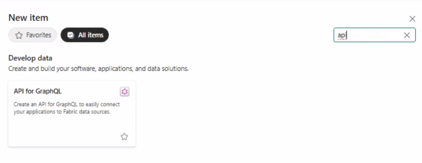
            *   Give the API a name (e.g., “SalesGraphQLAPI”).
            *   Open the new GraphQL API item, then click **Get data**.
            *   Choose your data source and load the table:
                *   If you see a choice like **Connect to Fabric or external data sources using a saved credential**, select it (this is common in lab environments).
                *   Select your Lakehouse (e.g., `SalesLakehouse`).
                *   Select the curated table (typically `sales_curated`). In some experiences it may show a schema-qualified name like `dbo.sales_curated` — either way, it’s the same table.
                *   Click **Load**.
            *   In the GraphQL API editor, confirm the table appears in **Schema explorer** (left pane), then click **Generate schema** (if prompted) so the API can expose fields.
            *   If you see **Save** or **Publish**, select it. If you don’t see a save control, the GraphQL API editor is typically auto-saved—continue to the next step.
        2.  Obtain the **GraphQL endpoint URL**. In the GraphQL API item, use the **Copy endpoint** function.
            *   Depending on your tenant/preview experience, the endpoint can look like either of these (both are valid):\
                `https://api.fabric.microsoft.com/v1/workspaces/<WorkspaceID>/items/<ItemID>/graphql`\
                `https://<workspaceGuid>.z*.graphql.fabric.microsoft.com/v1/workspaces/<workspaceGuid>/graphqlapis/<graphqlApiId>/graphql`
            *   Use the exact URL you copied – that’s what clients will call to query the data.
        3.  Ensure you (and the service principal that will be used later) have permission to execute queries on this API. This is set on the **GraphQL API item** (not a general workspace setting). In the workspace item list, open the **...** menu for your GraphQL API item and select **Manage permissions** (or **Manage access**) and enable the ability to **run queries and mutations** (wording can vary by tenant/preview).
        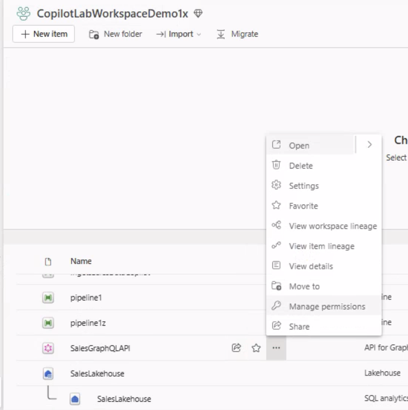

        **Note:** Your lab account is already a workspace admin and doesn't need any additional permissions. If you click **Add user**, you will see the permission options. 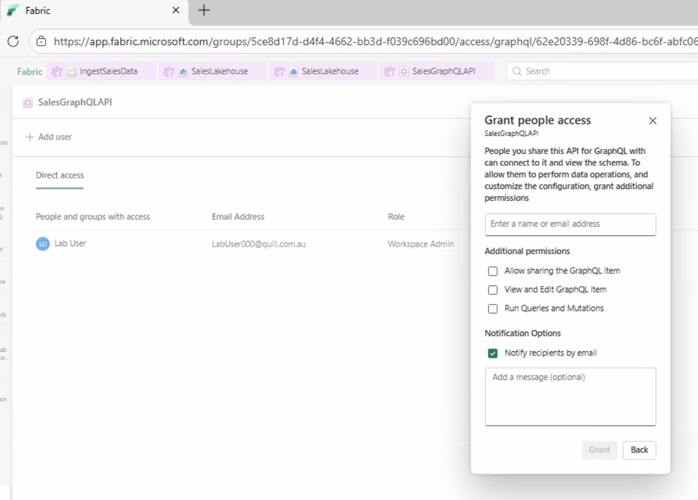
    *   *Assumption:* We will proceed assuming GraphQL (Option A) is set up. It’s the more explicit method and gives us a clear endpoint to call.
4.  **Recap:** At this point, you have:
    *   The **sales data** in Fabric (from Lab 001).
    *   A **GraphQL API endpoint URL** that can return that data when queried.
    *   (If GraphQL was set up by instructor, they will provide you the endpoint URL and any necessary credentials to use it. Make sure you have those details before continuing.)

> **Concept – GraphQL:** GraphQL is a query language for APIs that allows clients to request exactly the data they need. Unlike REST, where you might have multiple endpoints for different data, a GraphQL endpoint can flexibly return different fields or perform aggregations as defined in the query. In our case, the GraphQL API wraps our Lakehouse table. We can write GraphQL queries (like “give me the total orders by month”) against this endpoint. This is what our agent or proxy will do to fetch the data.

***

## Task 2: *(Instructor-Led Demonstration)* Create a Microsoft Foundry Agent Connected to Fabric

**⚠️ Note to students (live lab):** This task is usually demonstrated by the instructor so the class can move quickly and avoid per-student setup of models/permissions. If you want to repeat the lab later in your own tenant, you can follow these same steps to create the agent yourself.

**Why?** We want an AI agent that can answer questions about our data. Microsoft Foundry is a platform where we can create such an agent backed by a large language model (LLM) (e.g., GPT-4). We will configure the agent with:

*   A *purpose/role* (to assist with sales data questions).
*   Access to a *tool* that lets it query the Fabric data (the GraphQL endpoint or Data Agent).
*   Instructions to use that tool when needed.

By doing this, the agent can take a user’s question in natural language, retrieve relevant data via the tool, and then respond with an answer.

**What happens in this task (steps):**

1.  **Open Microsoft Foundry:** Sign in to the Microsoft Foundry portal.
2.  **Select or create a project:** In Foundry, agents are organized under projects. Use the project provided for the workshop, or create a new one (e.g., “FabricWorkshopProject”) when practicing later.
3.  **Create a new Agent (example: FabricSalesAgent):** Create an agent (for example named **`FabricSalesAgent`**) with settings such as:
    *   **LLM Model:** Choose an appropriate model (e.g., GPT-4 or a specified foundation model available in Foundry).
    *   **System Instructions:** A prompt that defines the agent’s role, e.g.: *“You are a sales data assistant. You can answer questions about sales performance using the data tool provided.”*
    *   Keep the agent focused: The instructions may emphasize using the data tool rather than guessing.
4.  **Add an Action (tool) for the Fabric data:** This is crucial – it links the agent to our data.

    *   **Important UI translation:** In Microsoft Foundry, adding a “tool” is done via **Add action**. If you choose **OpenAPI 3.0 specified tool**, Foundry will always prompt you to **paste an OpenAPI schema** (this is the screen you’re seeing).
    *   **Recommended for this lab (best learning path):** Add the **proxy** as the tool. The proxy is what will handle authentication to Fabric and exposes a simple request shape the agent can call.
    *   In Foundry: **Add action** → **OpenAPI 3.0 specified tool**.
    *   Name: `fabric_mcp_proxy` (or similar).
    *   Authentication method: **Anonymous**.
    *   Schema: paste the OpenAPI schema below.
    *   For now, set `servers.url` to a placeholder. In Task 4, you’ll update it to your public ngrok URL.
        *   If Foundry says “schema format is invalid”, the two most common causes are:
            *   The schema field expects an OpenAPI document as a **JSON object**. If you paste YAML (for example `openapi: 3.0.3`) you can get errors like “Expected a JSON object, array or literal”.
            *   The OpenAPI version key must be `openapi` (lowercase), and `servers[0].url` must be a valid URL/hostname. Avoid placeholders with underscores like `https://YOUR_PROXY_HOST`.
            *   `servers[0].url` should be the **base URL** only (no endpoint path). Foundry will call the path from `paths` (for this tool that’s `/mcp/query`).

        ```json
        {
            "openapi": "3.0.3",
            "info": {
                "title": "Fabric MCP Proxy",
                "version": "1.0.0",
                "description": "Controlled query endpoint for Fabric sales data (agent calls this; proxy handles auth)."
            },
            "servers": [
                {
                    "url": "https://example.com"
                }
            ],
            "paths": {
                "/mcp/query": {
                    "post": {
                        "operationId": "mcpQuery",
                        "summary": "Run an allowed sales query",
                        "requestBody": {
                            "required": true,
                            "content": {
                                "application/json": {
                                    "schema": {
                                        "type": "object",
                                        "additionalProperties": false,
                                        "properties": {
                                            "type": {
                                                "type": "string",
                                                "description": "Query type selector",
                                                "enum": ["sales_by_month"]
                                            },
                                            "limit": {
                                                "type": "integer",
                                                "description": "Number of rows/months to return",
                                                "minimum": 1,
                                                "maximum": 100,
                                                "default": 12
                                            }
                                        },
                                        "required": ["type"]
                                    }
                                }
                            }
                        },
                        "responses": {
                            "200": {
                                "description": "Query result",
                                "content": {
                                    "application/json": {
                                        "schema": {
                                            "type": "object",
                                            "properties": {
                                                "data": { "type": "object" }
                                            },
                                            "required": ["data"]
                                        }
                                    }
                                }
                            }
                        }
                    }
                }
            }
        }
        ```

    *   **Keep it simple:** Do **not** add a direct Fabric GraphQL action in Foundry for this lab. Fabric GraphQL requires `Authorization: Bearer <token>` (Entra ID), and the OpenAPI action experience typically won’t manage those tokens reliably.
    *   If using **Fabric Data Agent:** Add a Fabric-specific tool:
        *   Foundry might provide a way to connect to the Fabric Data Agent (perhaps by selecting the workspace and Lakehouse and using existing credentials).
        *   This would let the agent ask questions that get forwarded to Fabric’s Q\&A.
        *   If you’re prompted for **`workspace-id`** and **`artifact-id`** (as “Custom keys” when creating an **Azure Fabric AI Skill** / Fabric data agent connection), copy them from the **published Fabric data agent endpoint**:
            *   Endpoint format: `https://fabric.microsoft.com/groups/<workspace-id>/aiskills/<artifact-id>`
            *   `workspace-id` is the GUID after `/groups/`
            *   `artifact-id` is the GUID after `/aiskills/`
    *   In both cases, the tool’s description will be provided so the agent knows how to use it.
5.  **Save the agent/tool setup:** At this point, the agent exists within Foundry, but it may not be fully functional until the tool points to a reachable proxy URL (Task 4).
6.  **Test briefly:** In the Foundry test chat, try a simple prompt (for example: “Call the tool and show me the raw JSON”). If the tool is configured correctly, you should see a tool call.
7.  **Collect the details you’ll need for the rest of the lab:** Make sure you have:
    *   The **GraphQL endpoint URL** (if not already noted).
    *   Confirmation of the data (table name, etc., in case needed for queries).
    *   If the Foundry agent has an accessible endpoint or ID for your proxy to call, those details (in many cases, though, we won’t call the agent via HTTP; we’ll call the data through the proxy, and the agent’s logic will run in Foundry when we test it there).
    *   Essentially, for your purposes in upcoming tasks: you know there is an agent configured to use a data tool. We will build a proxy for that agent to use.

> **Concept – Microsoft Foundry Agent:** Think of this agent as an AI chatbot specialized for your scenario. It uses a powerful language model. By itself, it doesn’t have your sales data – but when given a “tool” that it can call (like an API), it can combine its language understanding with factual data retrieval. The agent’s instructions ensure it knows *when* to use the tool (for example, whenever the user asks for actual data or numbers). The reason the instructor sets this up (and not you) is because it involves Azure subscription resources and model access that are managed for the class.

***

## Task 3: Implement a Minimal MCP-Style Proxy Service

**Why?** The Foundry agent needs a reliable way to access governed data, but it should not manage Entra ID tokens or call Fabric directly. A small local **proxy** handles authentication and exposes a simple, safe API the agent can call.

With the data endpoint ready (Task 1) and an agent configured (Task 2), create a **minimal proxy** that:

*   Gets an Entra ID token (client credentials) and calls Fabric GraphQL
*   Accepts a *very small* request shape from the agent (we’ll allow only `type: "sales_by_month"`)

**Steps:**

### 3.1 Set Up the Proxy Project Environment

Follow these steps exactly on Windows.

1.  **Create the project folder in File Explorer**
    1.  Open **File Explorer**.
    2.  Browse to your lab working directory (for example: `C:\Users\LabUser000\Documents\`). **Make sure you use your documents folder**
    3.  Right-click → **New** → **Folder**.
    4.  Name the folder: `fabric-mcp-proxy`.
    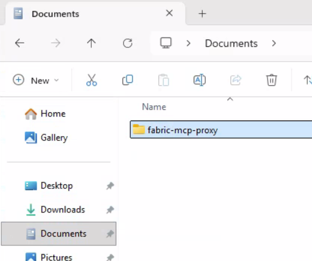

2.  **Open the new folder in VS Code**
    1.  Open **Visual Studio Code**.
    2.  Go to **File** → **Open Folder...**
    3.  Select the folder you just created: `fabric-mcp-proxy`.
    4.  When prompted, click **Yes, I trust the authors** (lab environment).

3.  **Open a terminal in VS Code**
    1.  Go to **Terminal** → **New Terminal**.
    2.  Confirm the terminal prompt path ends with `fabric-mcp-proxy`.

4.  **Create and activate a Python virtual environment**

    ```powershell
    python -m venv .venv
    .\.venv\Scripts\Activate.ps1
    ```

    > If you get a PowerShell execution policy error, run this once (in the same terminal), then activate again:
    >
    > ```powershell
    > Set-ExecutionPolicy -Scope Process -ExecutionPolicy Bypass
    > .\.venv\Scripts\Activate.ps1
    > ```

5.  **Install the required Python packages**

    ```powershell
    pip install flask requests msal
    ```

6.  **Set required environment variables (provided by the instructor/lab setup)**
    1.  Gather these values from the instructor:
        *   `TENANT_ID`
        *   `CLIENT_ID`
        *   `CLIENT_SECRET`
        *   `GRAPHQL_URL` (the Fabric **Copy endpoint** URL from Task 1)
    2.  Set them for your current terminal session:

        > **Instructor note:** For the live lab, the instructor will provide a single copy/paste PowerShell snippet containing the real values (especially the secret). Do not store `CLIENT_SECRET` in the markdown/repo.

    ```powershell
    $env:TENANT_ID = "<tenant-guid>"
    $env:CLIENT_ID = "<app-client-id-guid>"
    $env:CLIENT_SECRET = "<client-secret>"
    $env:GRAPHQL_URL = "https://<your-fabric-graphql-endpoint>"
    ```

    > These `$env:` values apply only to the current terminal window. If you open a new terminal, set them again.

### 3.2 Implement the proxy (`app.py`)

Follow these steps exactly.

1.  **Create a new file named `app.py`**
    1.  In VS Code, in the left **Explorer** panel, confirm the top folder is **`fabric-mcp-proxy`**.
    2.  Click **New File** (or right-click the folder → **New File**).
    3.  Name it: `app.py` and press **Enter**.

2.  **Paste the proxy code**
    1.  Click into the `app.py` editor.
    2.  Copy and paste the full code block below.

3.  **Save the file**
    1.  Press **Ctrl+S**.
    2.  Confirm `app.py` appears under the `fabric-mcp-proxy` folder (next to `.venv`).

Here is the complete `app.py` (single endpoint `POST /mcp/query`):

```python
import os

import msal
import requests
from flask import Flask, jsonify, request


app = Flask(__name__)


def _get_access_token() -> str:
    client_id = os.getenv("CLIENT_ID")
    client_secret = os.getenv("CLIENT_SECRET")
    tenant_id = os.getenv("TENANT_ID")
    if not client_id or not client_secret or not tenant_id:
        raise RuntimeError("Missing one of CLIENT_ID/CLIENT_SECRET/TENANT_ID")

    confidential_client = msal.ConfidentialClientApplication(
        client_id=client_id,
        client_credential=client_secret,
        authority=f"https://login.microsoftonline.com/{tenant_id}",
    )

    token_result = confidential_client.acquire_token_for_client(
        scopes=["https://analysis.windows.net/powerbi/api/.default"]
    )
    access_token = token_result.get("access_token")
    if not access_token:
        raise RuntimeError(f"Token acquisition failed: {token_result}")
    return access_token


@app.post("/mcp/query")
def mcp_query():
    body = request.get_json(force=True) or {}
    if body.get("type") != "sales_by_month":
        return jsonify({"error": "Unsupported type. Use sales_by_month."}), 400

        # Lab query for the SalesLakehouse -> sales_curated table.
    graphql_query = """
query {
    __typename
}
""".strip()

    graphql_url = os.getenv("GRAPHQL_URL")
    if not graphql_url:
        return jsonify({"error": "Missing GRAPHQL_URL"}), 500

    access_token = _get_access_token()
    resp = requests.post(
        graphql_url,
        headers={"Authorization": f"Bearer {access_token}"},
        json={"query": graphql_query, "variables": {}},
        timeout=30,
    )
    return jsonify(resp.json()), resp.status_code


if __name__ == "__main__":
    app.run(host="0.0.0.0", port=5000, debug=True)
```

    > **Note:** The `__typename` query is only a connectivity check. It proves your token + endpoint work, but it will NOT return sales numbers.
    >
    > To answer questions like “orders and revenue by month”, replace `graphql_query` with a real query from your Fabric GraphQL schema.

#### Upgrade the proxy to return real sales-by-month data

Once the connectivity check works, update **your local** `app.py` so the tool returns real data.

In your `app.py`, replace the entire `mcp_query()` function with this version (it uses the exact fields you validated in Fabric: `SalesOrderNumber`, `OrderDate`, `LineTotal`):

```python
@app.post("/mcp/query")
def mcp_query():
    body = request.get_json(force=True) or {}
    if body.get("type") != "sales_by_month":
        return jsonify({"error": "Unsupported type. Use sales_by_month."}), 400

    limit = body.get("limit", 12)
    try:
        limit = int(limit)
    except Exception:
        return jsonify({"error": "limit must be an integer"}), 400
    if limit < 1 or limit > 100:
        return jsonify({"error": "limit must be between 1 and 100"}), 400

    graphql_query = """
query SalesRows($first: Int!) {
  sales_curateds(first: $first) {
    items {
      SalesOrderNumber
      OrderDate
      LineTotal
    }
  }
}
""".strip()

    graphql_url = os.getenv("GRAPHQL_URL")
    if not graphql_url:
        return jsonify({"error": "Missing GRAPHQL_URL"}), 500

    access_token = _get_access_token()
    resp = requests.post(
        graphql_url,
        headers={"Authorization": f"Bearer {access_token}"},
        json={"query": graphql_query, "variables": {"first": 5000}},
        timeout=30,
    )
    payload = resp.json()
    if resp.status_code != 200:
        return jsonify(payload), resp.status_code
    if payload.get("errors"):
        return jsonify(payload), 502

    items = (((payload.get("data") or {}).get("sales_curateds") or {}).get("items")) or []

    # Aggregate into month buckets so the agent gets a small, stable JSON result.
    by_month = {}
    for item in items:
        order_date = (item or {}).get("OrderDate")
        order_number = (item or {}).get("SalesOrderNumber")
        line_total = (item or {}).get("LineTotal")

        if not order_date or not isinstance(order_date, str) or len(order_date) < 7:
            continue
        month = order_date[:7]  # YYYY-MM

        try:
            revenue = float(line_total or 0)
        except Exception:
            revenue = 0.0

        bucket = by_month.get(month)
        if bucket is None:
            bucket = {"orders": set(), "revenue": 0.0}
            by_month[month] = bucket
        if order_number:
            bucket["orders"].add(str(order_number))
        bucket["revenue"] += revenue

    months = []
    for month in sorted(by_month.keys(), reverse=True)[:limit]:
        bucket = by_month[month]
        months.append(
            {
                "month": month,
                "orders": len(bucket["orders"]),
                "revenue": round(bucket["revenue"], 2),
            }
        )

    return jsonify({"months": months}), 200
```

> If your schema uses different field names, update the `items { ... }` fields to match what you see in Fabric’s Schema Explorer.


### 3.3 Run and test locally

You will use **two terminals**:

1.  **Terminal 1: Run the proxy**
    1.  In VS Code: **Terminal** → **New Terminal**.
    2.  Make sure you already set `TENANT_ID`, `CLIENT_ID`, `CLIENT_SECRET`, and `GRAPHQL_URL` in this terminal (Task 3.1).
    3.  Run:

    ```powershell
    python app.py
    ```

    4.  Leave this terminal running.
    5.  It’s OK to see the Flask development server warning:
        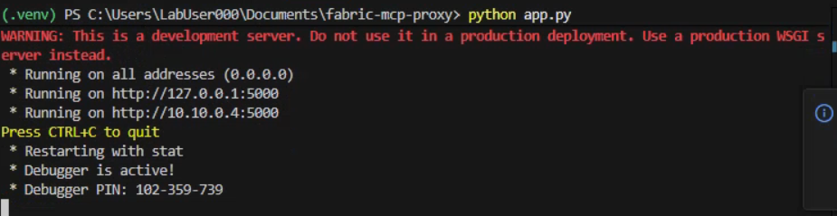

2.  **Terminal 2: Test the proxy endpoint**
    1.  Open a second terminal (VS Code: **Terminal** → **New Terminal**).
    2.  Run:

    ```powershell
    Invoke-RestMethod -Method Post -Uri http://localhost:5000/mcp/query -ContentType application/json -Body '{"type":"sales_by_month"}'
    ```

3.  **Expected result (success)**
    After upgrading `mcp_query()` above, you should see `months` returned, e.g.:

    ```text
    months
    ------
    {@{month=2019-12; orders=...; revenue=...}, @{month=2019-11; orders=...; revenue=...}}
    ```

> **If you get `Unauthorized: User is not authorized`:** Your token was accepted, but the **service principal** does not have access to the Fabric workspace/item.
> Ask the instructor to (1) allow service principals for Fabric/Power BI APIs in tenant settings (if restricted), and (2) add the app/service principal as a **Member/Contributor** to the Fabric workspace that hosts the GraphQL API (and grant access to the GraphQL API item if required).

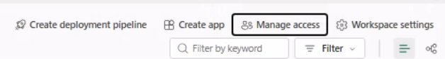

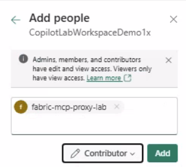


If it is successful, you will see a screen like:
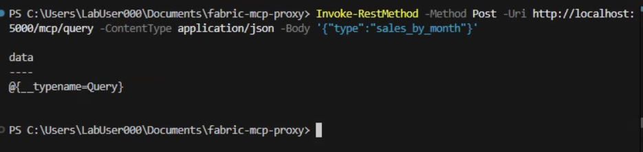


> **Concept – MCP Proxy:** The agent calls your proxy. The proxy (not the agent) handles Entra ID auth and calls Fabric GraphQL.

***

## Task 4: Register the Proxy as an MCP Tool in Foundry and Test End-to-End

**Why?** This is where the lab becomes end-to-end: the agent calls your proxy as a tool, and your proxy retrieves real data from Fabric. You will validate the full chain: **Foundry Agent -> MCP Proxy -> Fabric Data -> Proxy -> Agent answer**.

Now that your proxy is running and tested, the next step is to connect it with the Microsoft Foundry agent (from Task 2). This means updating the agent’s configuration to use our proxy as its tool for data access.

**Steps (Windows + VS Code, step-by-step):**

1.  **Keep (or start) the proxy running (reuse Terminal 1)**
    1.  In VS Code, go to the terminal where you ran `python app.py` in Task 3.3.
    2.  Confirm it is still running (you should see Flask output and the terminal should not have returned to the prompt).
    3.  If you closed that terminal, open a new terminal, re-set the `$env:` variables from Task 3.1 in that terminal, then run:

    ```powershell
    python app.py
    ```

2.  **Expose your local proxy with ngrok (open a NEW terminal)**
    1.  In VS Code: **Terminal** → **New Terminal**.
        - This is a separate terminal so you can leave the proxy running.
    2.  Check whether ngrok is already available:

    ```powershell
    ngrok version
    ```

    3.  If you get `ERR_NGROK_121` ("ngrok-agent version ... is too old") or your version is less than `3.7.0`, upgrade ngrok.

    Try the self-updater first:

    ```powershell
    ngrok update
    ngrok version
    ```

    If you still have an old version, try WinGet:

    ```powershell
    winget source update
    winget upgrade ngrok.ngrok
    ngrok version
    ```

    If WinGet says **no available upgrade**, download the latest ngrok zip (no admin needed):

    ```powershell
    $zip = "$env:TEMP\ngrok.zip"
    $dest = "$env:USERPROFILE\tools\ngrok"
    Invoke-WebRequest -Uri "https://bin.equinox.io/c/bNyj1mQVY4c/ngrok-v3-stable-windows-amd64.zip" -OutFile $zip
    New-Item -ItemType Directory -Force -Path $dest | Out-Null
    Expand-Archive -Path $zip -DestinationPath $dest -Force
    $env:Path = "$dest;$env:Path"
    ngrok version
    ```
    

    4.  If you get `ngrok : The term 'ngrok' is not recognized...`, install it:

    ```powershell
    winget install ngrok.ngrok
    ```

    5.  Close and re-open the terminal (PATH updates often require a new terminal).

    6.  If it is still not recognized (common in lab images), add the WinGet links folder to PATH for this terminal session:

    ```powershell
    $env:Path = "$env:LOCALAPPDATA\Microsoft\WinGet\Links;$env:Path"
    ngrok version
    ```

    7.  Run ngrok:

    ```powershell
    ngrok http 5000
    ```

    8.  If you get `ERR_NGROK_4018` ("Usage of ngrok requires a verified account and authtoken"), do this once:

    1.  Create/verify your ngrok account: `https://dashboard.ngrok.com/signup`
    2.  Get your authtoken from: `https://dashboard.ngrok.com/get-started/your-authtoken`
    3.  Install your authtoken (do not paste this into the lab markdown or share it publicly):

    ```powershell
    ngrok config add-authtoken <your-ngrok-authtoken>
    ```

    4.  Then run ngrok again:

    ```powershell
    ngrok http 5000
    ```

    > Fallback: if needed, run ngrok by full path:
    >
    > ```powershell
    > & "$env:LOCALAPPDATA\Microsoft\WinGet\Links\ngrok.exe" http 5000
    > ```

    9.  In the ngrok output, find the **HTTPS** forwarding URL (example: `https://abcd1234.ngrok.io`).
    10.  Copy the **base URL only** (do not add `/mcp/query`).

    > Security note (lab): the proxy is unauthenticated, so treat the ngrok URL as temporary and don’t share it publicly.

3.  **(Instructor-led) Update the Foundry agent tool to point to your ngrok URL**
    1.  In Microsoft Foundry, open the agent (for example, **FabricSalesAgent**).
    2.  Go to **Actions/Tools** (wording may vary) and add or edit an **OpenAPI 3.0 specified tool**.
    3.  Set:
        - **Name:** `fabric_mcp_proxy` (example)
        - **Authentication method:** **Anonymous** (lab)
        - **OpenAPI schema:** paste the **Fabric MCP Proxy** schema from Task 2
        - **Servers URL:** paste your ngrok **base URL** (example: `https://abcd1234.ngrok.io`)
          - Do NOT include `/mcp/query` here.
    4.  Tool description (copy/paste):
        - “Use `fabric_mcp_proxy` for questions requiring sales numbers. Call it with `type: "sales_by_month"` (optional `limit`) to retrieve JSON of `{ months: [{ month, orders, revenue }] }`. Use those numbers in your answer.”
    5.  Save the agent/tool changes.

4.  **Test end-to-end from the Foundry chat**
    1.  Sanity check (forces a tool call):
        - “Call `fabric_mcp_proxy` with `{ "type": "sales_by_month", "limit": 12 }` and show me the raw JSON.”
    2.  In the Foundry agent test chat, ask:
        - “What were the total orders and revenue by month?”
    3.  Watch your proxy terminal (Terminal 1):
        - You should see a `POST /mcp/query` request.
    4.  If the agent answers without calling the tool:
        - Improve the tool description (make it more explicit that numbers must come from the tool), then re-test.

5.  **Try a second test question**
    - “Which month had the highest number of orders?”
6.  **Discuss / note what happened:**
    *   The agent now effectively delegates data retrieval to the proxy. The LLM didn’t have to know how to write GraphQL or how to authenticate anywhere – it just knows “when I need data, call this tool.”
    *   The proxy ensured the query was safe and efficient.
    *   This architecture decouples the language understanding part (agent) from the data access part (proxy), which is a good design for maintainability and security.

> **Insight:** We have implemented a pattern where the AI agent does what it’s good at (understanding the question and presenting an answer), and the proxy does what it’s good at (fetching accurate data under governance constraints). This is a miniature version of a robust AI system where, for example, an AI assistant can answer business questions but all actual data fetching goes through audited services.

***

## Task 5: (Optional) Add a Simple Web Chat Experience

**Why?** This optional task shows how a simple front-end could call your backend. It is not calling Foundry directly; it’s a lightweight “demo UI” that hits your Flask app.

*This task is optional and showcases how you might present this agent+proxy system to end-users.* You will build a tiny “chat-like” web page that posts a question to your Flask backend (`/ask`) and displays an answer.

### Prerequisites

- Your proxy is already returning real data from `POST /mcp/query` in this shape:

    ```json
    {
        "months": [
            {"month": "YYYY-MM", "orders": 123, "revenue": 4567.89}
        ]
    }
    ```

**Steps:**

1. **Create the HTML page**

     1. In your proxy folder (the same folder as `app.py`), create a folder named `static`. 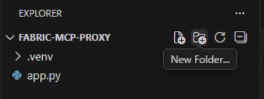 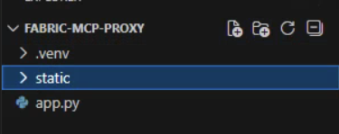
     2. Inside `static`, create a file named `index.html`. 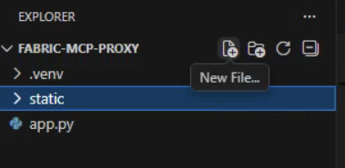 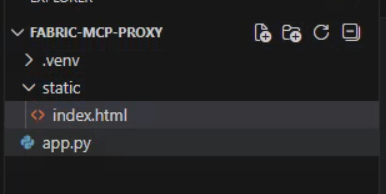
     3. Paste this minimal page:

            ```html
            <!doctype html>
            <html lang="en">
                <head>
                    <meta charset="utf-8" />
                    <meta name="viewport" content="width=device-width, initial-scale=1" />
                    <title>Sales Chat (Demo)</title>
                    <style>
                        body { font-family: system-ui, sans-serif; margin: 24px; }
                        #log { border: 1px solid #ccc; padding: 12px; min-height: 180px; }
                        .msg { margin: 8px 0; }
                        .me { font-weight: 600; }
                    </style>
                </head>
                <body>
                    <h2>Sales Chat (Demo)</h2>

                    <div id="log"></div>

                    <div style="margin-top: 12px; display: flex; gap: 8px;">
                        <input id="q" style="flex: 1;" placeholder="Ask: What are orders and revenue by month?" />
                        <button id="askBtn">Ask</button>
                    </div>

                    <script>
                        const log = document.getElementById('log');
                        const q = document.getElementById('q');
                        const askBtn = document.getElementById('askBtn');

                        function addLine(who, text) {
                            const div = document.createElement('div');
                            div.className = 'msg';
                            div.innerHTML = `<span class="me">${who}:</span> ${text}`;
                            log.appendChild(div);
                            log.scrollTop = log.scrollHeight;
                        }

                        async function ask() {
                            const question = (q.value || '').trim();
                            if (!question) return;
                            addLine('You', question);
                            q.value = '';

                            const resp = await fetch('/ask', {
                                method: 'POST',
                                headers: { 'Content-Type': 'application/json' },
                                body: JSON.stringify({ question })
                            });

                            const data = await resp.json();
                            addLine('Bot', data.answer || '(no answer)');
                        }

                        askBtn.addEventListener('click', ask);
                        q.addEventListener('keydown', (e) => { if (e.key === 'Enter') ask(); });
                    </script>
                </body>
            </html>
            ```

2. **Add a route to serve the page**

    In your `app.py`, add this route **above your existing route block**.

    - Find the first line that starts with `@app.` (for example `@app.post("/mcp/query")` or `@app.get("/health")`).
    - Paste this `@app.get("/")` route **immediately above** that first `@app.` line.
    - Keep it **above** the `if __name__ == "__main__":` block at the bottom.

     ```python
     @app.get("/")
     def index():
         return app.send_static_file("index.html")
     ```
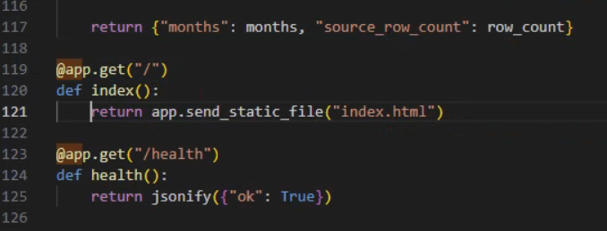


3. **Add an `/ask` endpoint (simple “agent simulation”)**

    This endpoint does two things:

    - It checks whether the question is asking for sales by **month**, **year**, or **day**.
    - If yes, it calls Fabric GraphQL and returns a short text answer.

    Add this to `app.py` **directly below** the `/` route you added in Step 2 (still above your existing `@app.post("/mcp/query")` route). This version calls Fabric GraphQL directly (no nested HTTP call back into your own server).

     ```python
     @app.post("/ask")
     def ask():
         body = request.get_json(force=True) or {}
         user_question = (body.get("question") or "").strip()
         q = user_question.lower()

         if not any(k in q for k in ("revenue", "order", "orders", "month", "year", "day")):
             return jsonify({"answer": "Try: orders and revenue by month (or year/day)."})

         granularity = "month"
         if "year" in q:
             granularity = "year"
         elif "day" in q or "date" in q:
             granularity = "day"
         elif "month" in q:
             granularity = "month"

         graphql_query = """
     query SalesRows($first: Int!) {
       sales_curateds(first: $first) {
         items {
           SalesOrderNumber
           OrderDate
           LineTotal
         }
       }
     }
     """.strip()

         graphql_url = os.getenv("GRAPHQL_URL")
         if not graphql_url:
             return jsonify({"answer": "Server is missing GRAPHQL_URL."}), 500

         access_token = _get_access_token()
         resp = requests.post(
             graphql_url,
             headers={"Authorization": f"Bearer {access_token}"},
             json={"query": graphql_query, "variables": {"first": 1000}},
             timeout=30,
         )
         payload = resp.json()
         if resp.status_code != 200 or payload.get("errors"):
             return jsonify({"answer": "Query failed. Check proxy logs."}), 502

         items = (((payload.get("data") or {}).get("sales_curateds") or {}).get("items")) or []

         by_period = {}
         for item in items:
             order_date = (item or {}).get("OrderDate") or ""

             s = str(order_date)
             if granularity == "year":
                 period = s[:4] if len(s) >= 4 else None
             elif granularity == "day":
                 period = s[:10] if len(s) >= 10 else None
             else:
                 period = s[:7] if len(s) >= 7 else None

             if not period:
                 continue

             order_no = (item or {}).get("SalesOrderNumber")

             try:
                 revenue = float((item or {}).get("LineTotal") or 0)
             except Exception:
                 revenue = 0.0

             bucket = by_period.setdefault(period, {"orders": set(), "revenue": 0.0})
             if order_no:
                 bucket["orders"].add(order_no)
             bucket["revenue"] += revenue

         periods = [
             {"period": p, "orders": len(b["orders"]), "revenue": round(b["revenue"], 2)}
             for p, b in sorted(by_period.items(), reverse=True)
         ]
         if not periods:
             return jsonify({"answer": f"I couldn't find any sales data grouped by {granularity}."})

         top = max(periods, key=lambda p: float(p.get("revenue") or 0))
         unit = "months" if granularity == "month" else ("years" if granularity == "year" else "days")
         answer = (
             f"I retrieved {len(periods)} {unit}. "
             f"Highest revenue was {top.get('revenue')} in {top.get('period')} "
             f"({top.get('orders')} orders)."
         )
         return jsonify({"answer": answer})
     ```

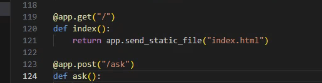

4. **Run and test the web page**

Follow these steps exactly on Windows.

1. **Start the Flask app (Terminal 1) Only if you have closed it from before**
    1. In VS Code, open a terminal.
    2. Make sure your terminal is in the same folder as `app.py`.
    3. If your venv is not active, activate it:

        ```powershell
        .\.venv\Scripts\Activate.ps1
        ```

    4. Confirm your environment variables are set in this terminal (`TENANT_ID`, `CLIENT_ID`, `CLIENT_SECRET`, `GRAPHQL_URL`).
    5. Start the server:

        ```powershell
        python app.py
        ```

    6. Leave this terminal running.

2. **Open the web page (Browser)**
    1. Open a browser to `http://localhost:5000/`.
    2. You should see **Sales Chat (Demo)**.
    3. Ask: “What are orders and revenue by month?”

3. **Optional: test `/ask` directly (Terminal 2)**
    1. Open a second terminal in VS Code.
    2. Run:

        ```powershell
        Invoke-RestMethod -Method Post -Uri http://localhost:5000/ask -ContentType application/json -Body '{"question":"What are orders and revenue by month?"}'
        ```

    3. Optional: try year/day so you can see different results:

        ```powershell
        Invoke-RestMethod -Method Post -Uri http://localhost:5000/ask -ContentType application/json -Body '{"question":"What are orders and revenue by year?"}'
        Invoke-RestMethod -Method Post -Uri http://localhost:5000/ask -ContentType application/json -Body '{"question":"What are orders and revenue by day?"}'
        ```

4. **Troubleshooting (common issues)**
    - If `http://localhost:5000/` shows **404**, confirm you created `static\index.html` in the same folder as `app.py`.
    - If `/ask` says the server is missing `GRAPHQL_URL`, set `$env:GRAPHQL_URL` in the same terminal where you run `python app.py`.
    - If `/ask` returns “Query failed”, check `GRAPHQL_URL` and that the service principal has access to the Fabric workspace/item.

5. **Compare to Foundry**

     - This optional UI is a simple demo and does not call Foundry directly.
     - Foundry will give a richer, LLM-formatted answer; this UI shows how a browser could talk to your backend.

> **Wrap-up of Optional UI:** This step is not required to complete the lab objectives; it’s to help you visualize how an end user might experience the solution. We built a minimal web UI to ask questions. Under the hood, it hit our proxy (through a simplified route). In a production scenario, a user’s question could trigger a call to the Foundry agent (which uses the proxy as needed), and the answer would be returned to display. The take-home idea is that the system we set up is flexible – the “brain” (agent) and “data access” (proxy) can be used by many front-ends or applications to provide a Q\&A experience over governed data.

***

## Optional Exercise (For Fun): Try Fabric Data Agent

If your tenant has it enabled (and your instructor is OK with it), you can try Fabric’s built-in natural language experience directly against your Lakehouse.

1.  **Open the Lakehouse:** Open `SalesLakehouse` and confirm the `sales_curated` table exists.
2.  **Enable/Configure a Fabric Data Agent (if available):** The instructor (or you, if permitted) can enable a data agent against `SalesLakehouse` / `sales_curated` from the Copilot/Data Engineering experience in Fabric.
3.  **Ask a few questions in the Data Agent UI:** For example: “What is the total revenue?” or “Which month has the highest revenue?”
4.  **Compare results:** Compare the Data Agent answers to what you got via the GraphQL + proxy approach.

> **Note:** This optional exercise is separate from the main workshop flow. The rest of this lab continues to use GraphQL + the MCP proxy for controlled access.

***

## Cleanup

After finishing the lab, you should clean up resources to avoid unnecessary costs or conflicts, especially because we used external services and local processes.

1.  **Stop the Flask proxy service:** Go to the terminal where Flask is running and press **Ctrl+C** to stop it. This will shut down the local web server.
2.  **Stop ngrok (if used):** If you used ngrok or any tunneling service, terminate it (Ctrl+C in its terminal). This closes the public URL.
3.  **Shut down Redis:** If you started a Redis server (locally or in Docker), stop it. If it’s a cloud instance provided for the lab, check with your instructor if it should be turned off. For a local Docker container, you can remove it to free memory.
4.  **Microsoft Foundry agent:** Since the agent was likely created in a shared environment by the instructor, you don’t have direct cleanup for it. The instructor will handle any teardown of Azure resources. If by any chance you did create an agent in your own subscription for practice, you can delete it in the Foundry portal to avoid any unintended usage.
5.  **Azure AD App & GraphQL API:** Again, these are typically set up by facilitators. In a personal scenario, if you registered an app for this, consider deleting the app registration or at least the secret, especially if it was created in a test environment. The Fabric GraphQL API in your workspace can remain for future labs or usage unless instructed to remove it.
6.  **Retain the workspace and Lakehouse:** Do **not** delete the Fabric workspace or Lakehouse unless told to. The data you ingested might be used in subsequent labs or explorations. In many cases, Lab 001’s workspace is reused in later labs. Only if this was the final exercise and instructors say to clean everything, then you might remove the workspace.
7.  **Sign out and close:** Sign out of the Fabric portal and any Azure portal or Foundry portal if you were logged in. Close browser tabs to ensure no one can use your authenticated sessions.
8.  **Review learnings:** Optionally, take note of the configurations you used (like the GraphQL query, the proxy code) as references for building similar solutions. The patterns learned here – GraphQL integration, using an LLM agent with tools, building a proxy for governance – are valuable beyond the lab.

**Why cleanup:** Besides being a good practice in shared or cost-incurring environments, cleaning up helps cement what resources were involved. It reminds you what pieces were created:

*   A GraphQL API in Fabric (which is a resource that can be managed).
*   A Foundry agent (an Azure resource).
*   Local services (Flask app, Redis).
*   Supporting infrastructure (Azure AD app for auth).
    By shutting down or removing those, you ensure that nothing is accidentally left running (which could incur charges or cause unintended access). It also leaves the environment in a clean state for the next time or for others.

***

**Congratulations!** You’ve completed Lab Demo 002. Let’s recap what you accomplished:

*   **Verified data availability** in Fabric and exposed it via a **GraphQL API**.
*   **(Instructor)** Set up an **AI agent** in Foundry with the ability to query that data.
*   **Built a proxy service** implementing **authentication, caching, validation, and logging**, to mediate between the agent and Fabric.
*   **Integrated the agent and proxy** and successfully queried real data with an AI-driven approach.
*   Optionally, saw how a user interface can be layered on top of this system.

This end-to-end scenario is a powerful demonstration of **AI + data engineering integration**. You have an intelligent agent that can answer natural language questions, but all the data it uses is coming through a governed, secure pipeline that you control. This pattern ensures that AI-driven insights remain accurate (grounded in real data) and compliant with data access rules. Great work on completing the lab!

***

## Instructor Prep (Before Class): Create the Entra App + Secret for the Proxy

This lab’s proxy uses **client credentials** (MSAL) to get an access token. That requires an **Entra ID app registration** and a **client secret**. Students do **not** create these during the lab; the instructor/facilitators prepare them and provide the values.

### A) Create an app registration

1.  Sign in to the **Microsoft Entra admin center**.
2.  Go to **Identity** → **Applications** → **App registrations** → **New registration**.
3.  Set:
    *   **Name:** e.g., `fabric-mcp-proxy-lab`
    *   **Supported account types:** **Single tenant** (recommended for a lab)
    *   **Redirect URI:** leave blank (not needed for client credentials)
4.  Click **Register**.
5.  On the app’s **Overview** page, copy these values (you will give them to students):
    *   **Directory (tenant) ID** → `TENANT_ID`
    *   **Application (client) ID** → `CLIENT_ID`

### B) Create a client secret

1.  In the same app registration, go to **Certificates & secrets**.
2.  Under **Client secrets**, click **New client secret**.
3.  Set an expiry appropriate for the lab (short-lived is best), then click **Add**.
4.  Copy the **Value** immediately (it’s only shown once) → `CLIENT_SECRET`.

### C) Ensure the app can call Fabric/Power BI APIs used by GraphQL

> Exact permissions and tenant settings can vary by tenant policy and how the Fabric GraphQL endpoint is configured.

At a minimum, confirm the service principal is allowed to obtain a token for the scope used in the code:

*   The proxy requests: `scopes=["https://analysis.windows.net/powerbi/api/.default"]`

Typical instructor checks:

1.  **Tenant allows service principals to use the required APIs** (often a Power BI / Fabric tenant setting).
2.  **API permissions**: the app has the required **application permissions** for the Power BI/Fabric APIs used by your GraphQL endpoint.
3.  **Admin consent** is granted if your tenant requires it.

### D) Grant the app access to the data endpoint

1.  In **Fabric**, ensure the identity behind `CLIENT_ID` (service principal) is allowed to access the workspace/data behind your GraphQL API.
2.  If your organization uses groups, you can add the service principal to a security group and grant the group access.

### E) Provide the values to students

Give students:

*   `TENANT_ID`
*   `CLIENT_ID`
*   `CLIENT_SECRET`
*   `GRAPHQL_URL` (the Fabric API for GraphQL endpoint URL from Task 1)

Students then set these as environment variables and run the proxy.
